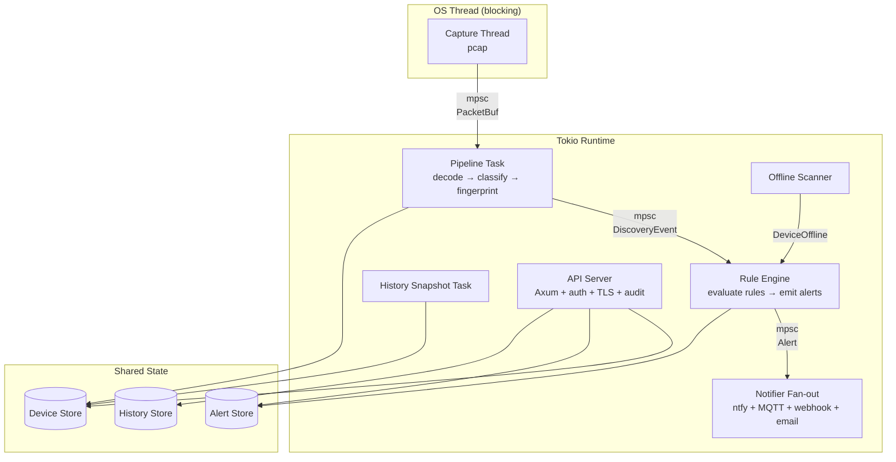
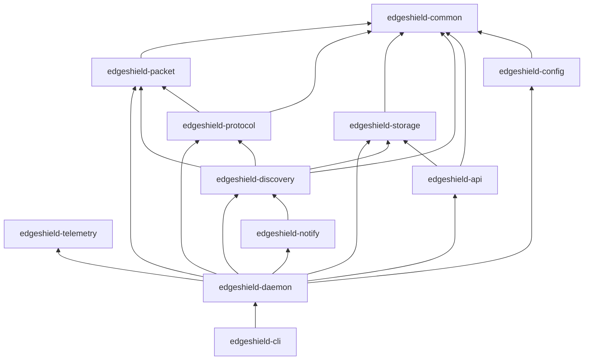
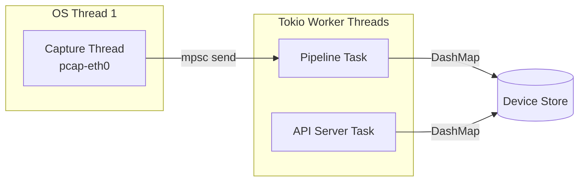

# EdgeShield Architecture

## High-Level Architecture

EdgeShield is a **pipeline-based network monitoring appliance** with concurrent stages connected by bounded mpsc channels. The architecture prioritizes bounded memory usage, clear ownership boundaries, and minimal shared state.



### Stage 1: Capture Thread

A dedicated OS thread reads raw Ethernet frames from a network interface using `pcap`. This runs on a blocking OS thread because pcap's API is synchronous and blocking.

- **Buffer model**: Each captured frame is converted from `Vec<u8>` to `bytes::Bytes` (refcounted, `'static` slice) and wrapped in a `PacketBuf` struct.
- **Backpressure**: The mpsc channel between capture and pipeline is bounded. When the channel is full, packets are dropped at the capture level. This is intentional — the system degrades gracefully under load rather than unboundedly growing memory.
- **Thread naming**: The capture thread is named `pcap-{interface}` for observability.

### Stage 2: Pipeline Task

A tokio async task receives `PacketBuf` values from the capture channel and runs them through three sequential stages:

1. **Decode** (`edgeshield-packet`): Parses Ethernet, IPv4, and transport-layer headers. Header fields are copied into owned structs. The payload is referenced via a borrow into the `PacketBuf`.
2. **Classify** (`edgeshield-protocol`): Pure function that maps decoded headers to a `Protocol` enum variant. Also extracts DHCP hostnames, mDNS service names, and NTP headers. HTTP banner sniffing catches HTTP on non-standard ports.
3. **Update** (`edgeshield-discovery`): Reads or creates `Device` records in the store, updates counters and protocol sets, populates vendor (OUI), hostname (DHCP/mDNS), and DHCP vendor class. Emits `DiscoveryEvent` values on the event channel.

### Stage 3: Rule Engine

A tokio async task consumes `DiscoveryEvent`s, evaluates user-configured rules, and emits `Alert`s. Supports five condition types (new_device, new_device_by_vendor, new_device_by_mac_prefix, device_offline, protocol_change) with per-device per-rule cooldown and acknowledgment suppression. Alerts are persisted to the `AlertStore` before delivery.

### Stage 4: Notifier Fan-out

A tokio async task delivers each alert to all configured notifiers (ntfy, MQTT, webhook, email) simultaneously. Each notifier implements the `Notifier` trait. A slow notifier doesn't block others.

### Stage 5: API Server

A tokio async task runs an Axum HTTP server with optional Bearer token authentication (SHA-256 hashed keys, constant-time comparison, per-IP rate limiting), TLS (rustls), and audit logging. Shares the `DeviceStore`, `AlertStore`, and `HistoryStore` via `Arc<dyn ...>`.

## Core Subsystems

### `edgeshield-common`

Foundation crate with zero workspace dependencies. Defines:

- `Device` — the central data model (MAC, IPs, hostname, vendor, DHCP vendor class, timestamps, counters, protocols, per-protocol stats)
- `Protocol` — enum of detected protocols (ARP, IPv4, ICMP, TCP, UDP, DNS, DHCP, HTTP, HTTPS, mDNS, NTP, Other)
- `Alert`, `Severity`, `AlertEventType` — alert types for the rule engine
- `AlertStore`, `DeviceHistoryStore` traits — storage abstractions
- `Timestamp` — ISO 8601 UTC timestamp newtype
- Error types for every subsystem

### `edgeshield-config`

Reads and validates TOML configuration. Uses `serde` for deserialization with sensible defaults. Validates interface names, rule names, severity strings, API key hash formats, and TLS paths at parse time.

### `edgeshield-telemetry`

Initializes the `tracing` subscriber with structured JSON output.

### `edgeshield-packet`

Owns the packet buffer lifecycle. `CaptureSession` manages the OS thread, pcap channel, and mpsc bridge. `PacketBuf` is a refcounted packet buffer with zero-copy sharing. `decode` parses Ethernet, IPv4, TCP, UDP, ICMP, and ARP headers.

### `edgeshield-protocol`

Pure protocol classification and payload parsing. The `classify()` function maps decoded headers to a `Protocol` variant. Includes parsers for DHCP (hostname + vendor class), mDNS (SRV/PTR records with DNS compression), NTP (header validation), and HTTP banner sniffing.

### `edgeshield-storage`

Defines the `DeviceStore` trait and provides three SQLite-backed stores:
- `SqliteStore` — device inventory (UPSERT on every packet)
- `SqliteAlertStore` — alert history (append-mostly, queryable via API)
- `SqliteHistoryStore` — daily device snapshots (UNIQUE(mac, snapshot_date) upsert)

All share the same SQLite database file. Schema migrations are idempotent (`ALTER TABLE ADD COLUMN` with duplicate-column error suppression).

### `edgeshield-discovery`

The `DiscoveryEngine` is the stateful core. It holds an `Arc<dyn DeviceStore>` and an event sender. The `process_packet()` method runs the full decode-classify-fingerprint-update pipeline for a single packet. Also emits `DeviceOffline` events from the background scanner.

### `edgeshield-rules`

The rule engine. `RuleEngine` consumes `DiscoveryEvent`s, evaluates rules, and emits `Alert`s. Includes the `AlertStore` trait (implemented by `InMemoryAlertStore` for tests and `SqliteAlertStore` for production), `AlertFilter`, and a config bridge that converts `RuleConfig` to runtime `Rule` objects.

### `edgeshield-notify`

Notification delivery. The `NotifierFanout` dispatches alerts to all configured notifiers simultaneously. Each notifier implements the `Notifier` trait:
- `NtfyNotifier` — HTTP POST to ntfy.sh
- `MqttNotifier` — MQTT publish
- `WebhookNotifier` — HTTP POST (Slack/Discord/Teams-compatible)
- `EmailNotifier` — SMTP via lettre

### `edgeshield-api`

Axum-based REST API with 10 endpoints. Includes Bearer token authentication (`auth.rs`), audit logging (`audit.rs`), and TLS support via `axum-server` + `rustls`. `AppState` holds the shared stores, auth state, and audit logger.

### `edgeshield-daemon`

The orchestrator. Wires together all subsystems in the `run()` function:

1. Initialize telemetry
2. Create the device store (SQLite or in-memory)
3. Create the event channel (discovery → rule engine)
4. Create the discovery engine
5. Build rules from config (default `new_device` rule if none configured)
6. Create the alert store (SQLite or in-memory)
7. Create the alert channel (rule engine → notifier fanout)
8. Start the rule engine
9. Build the notifier list from config
10. Start the notifier fanout
11. Start the offline scanner
12. Start the history snapshot task
13. Start the API server (with auth, TLS, audit)
14. Start packet capture
15. Spawn pipeline task
16. Wait for `SIGINT`/`SIGTERM`
17. Graceful shutdown

### `edgeshield-cli`

Binary entry point with `clap` argument parsing. Subcommands: `run`, `default-config`, `completions`.

## Layered Architecture



## Dependency Direction

Dependencies flow **inward** toward `edgeshield-common`. No crate at a lower layer depends on a crate at a higher layer.

| Layer | Crates | Depends On |
|-------|--------|------------|
| 0 (Foundation) | `common` | (none) |
| 1 (Infrastructure) | `config`, `telemetry` | `common` |
| 2 (Data Plane) | `packet`, `protocol`, `storage` | `common`, `packet` → `common` |
| 3 (Logic) | `discovery` | `common`, `packet`, `protocol`, `storage` |
| 4 (Interface) | `api`, `notify` | `common`, `discovery`, `storage` |
| 5 (Application) | `daemon` | all above |
| 6 (Entry) | `cli` | `daemon`, `config` |

## Data Flow

### Packet lifecycle

```text
Network Interface
    │
    ▼
pnet::datalink::channel (blocking)
    │  raw: Vec<u8>
    ▼
PacketBuf::new(data, 14)
    │  raw: bytes::Bytes (refcounted)
    │  link_header_len: 14
    ▼
mpsc::channel (bounded, async boundary)
    │
    ▼
decode_packet(&buf)
    │  DecodedPacket { ethernet, ipv4, transport, payload }
    ▼
classify(&decoded)
    │  Protocol::Tcp | Udp | Dns | Arp | Icmp | Ipv4 | Other
    ▼
DiscoveryEngine::process_packet(buf)
    │  store.get() / store.upsert()
    │  event_tx.try_send(DiscoveryEvent)
    ▼
Device Store (DashMap)          Event Channel (mpsc)
    │                               │
    ▼                               ▼
API Server                     (future WebSocket push)
```

### Event flow

```text
DiscoveryEngine
    │  event_tx.try_send(DiscoveryEvent::DeviceDiscovered | DeviceUpdated)
    ▼
mpsc::channel (bounded, 1024 capacity)
    │
    ▼
AppState.event_rx (Arc<Mutex<Receiver>>)
    │
    ▼
(future: WebSocket broadcast to connected clients)
```

## Async Model

EdgeShield uses the **tokio** runtime with the `full` features feature set. The async model is deliberately simple:

- **One runtime, multiple tasks**: A single tokio runtime runs the pipeline task and the API server task. The capture thread is an OS thread, not a tokio task.
- **No async in the hot path**: Packet decoding, classification, and store updates are synchronous. Only the channel receive (`recv().await`) is async. This avoids the overhead of async state machines in the per-packet path.
- **Bounded channels everywhere**: All mpsc channels are bounded. There is no unbounded growth path in the system.

```rust
// The pipeline task — the only async in the per-packet path
tokio::spawn(async move {
    while let Some(buf) = pipeline_rx.recv().await {
        pipeline_engine.process_packet(buf).await;
    }
});
```

## Ownership Model

EdgeShield follows Rust's ownership model strictly:

1. **Packet buffers**: `PacketBuf` wraps `bytes::Bytes`, which is a refcounted, `'static` slice. Cloning a `PacketBuf` bumps the reference count — no data copy. The buffer is allocated once by pnet and shared through the pipeline.
2. **Decoded headers**: Header fields are copied into owned structs. This is the right tradeoff because header fields are small (MAC: 6 bytes, IP: 4-16 bytes, ports: 2 bytes) and owned structs are `Send + Sync` without lifetime complexity.
3. **Device records**: `Device` is `Clone`. The store returns cloned records to avoid holding locks across await points. Updates are read-modify-write under a single shard lock (DashMap).
4. **Store sharing**: `Arc<dyn DeviceStore>` is the sharing primitive. The pipeline and API server each hold an `Arc` to the same store instance, which is either a `MemoryStore` or a `SqliteStore` depending on configuration.

## Threading Model



| Thread/Task | Count | Purpose |
|-------------|-------|---------|
| Capture thread | 1 per interface | Blocking packet capture via pnet |
| Pipeline task | 1 | Decode → classify → update |
| API server task | 1 | Axum HTTP server |
| Tokio worker threads | N (default: CPU count) | Async task scheduling |

The capture thread is the only OS thread. Everything else runs on the tokio runtime. The tokio runtime is configured with the default multi-thread scheduler, which uses one worker thread per CPU core.

## Error Handling Philosophy

EdgeShield uses a layered error handling strategy:

1. **Subsystem errors**: Each crate defines its own error enum using `thiserror`. Errors are explicit variants, not stringly-typed.
2. **Boundary conversion**: At subsystem boundaries, errors are converted to the target subsystem's error type or to `anyhow::Error`.
3. **Pipeline errors**: Errors in the packet pipeline are logged and the packet is dropped. The pipeline never returns errors to the caller — it processes packets in a fire-and-forget loop.
4. **API errors**: API handlers return HTTP status codes with descriptive error messages. Internal errors are logged and returned as 500.
5. **Startup errors**: Configuration and capture initialization errors propagate to the CLI and terminate the process with a clear error message.

```rust
// Example: subsystem error with context
#[derive(Error, Debug)]
pub enum PacketError {
    #[error("failed to open capture interface '{interface}': {source}")]
    CaptureOpen {
        interface: String,
        source: Box<dyn std::error::Error + Send + Sync>,
    },
    #[error("packet too short: expected at least {expected} bytes, got {actual}")]
    Truncated { expected: usize, actual: usize },
}
```

## Extension Points

EdgeShield is designed for extensibility from day one:

### `DeviceStore` trait

The storage backend is abstracted behind a trait. Two implementations ship today: `MemoryStore` (DashMap, default when no `database_path` is configured) and `SqliteStore` (persistent, selected when `database_path` is set). Additional backends (PostgreSQL, etc.) can be added by implementing `DeviceStore` without changing the discovery or API layers.

```rust
pub trait DeviceStore: Send + Sync {
    fn get(&self, mac: &MacAddress) -> Result<Option<Device>, StorageError>;
    fn upsert(&self, device: Device) -> Result<(), StorageError>;
    fn list(&self) -> Result<Vec<Device>, StorageError>;
    fn count(&self) -> Result<usize, StorageError>;
}
```

### Protocol classification

Adding a new protocol requires:
1. Add a variant to `edgeshield_common::Protocol`
2. Add a classification function in `edgeshield_protocol::classifier`
3. Call it from the `classify()` function

### Discovery events

The `DiscoveryEvent` channel allows the API layer to react to device changes without polling. Future uses include:
- WebSocket push to connected clients
- Webhook callbacks
- Metrics export

### Configuration

The `Config` struct uses `serde::Deserialize` with `#[serde(default)]` for optional fields. Adding a new configuration option requires only adding a field to the struct.

## Future Plugin System

The architecture supports a future plugin system through several design decisions:

1. **Trait-based abstraction**: `DeviceStore` is already a trait. Future plugin interfaces (detection engines, output sinks, authentication providers) will follow the same pattern.
2. **Event-driven architecture**: The `DiscoveryEvent` channel is a natural extension point for plugins. Plugins can subscribe to events without modifying core code.
3. **Crate isolation**: Each subsystem is a separate crate with a well-defined public API. Plugins can be distributed as separate crates that depend on `edgeshield-common` and implement the relevant traits.
4. **Dynamic loading (future)**: The workspace structure supports eventual dynamic plugin loading via `libloading` or a WASM-based plugin system. The trait-based interfaces are designed to be FFI-safe with minimal changes.

The planned plugin categories are:

| Category | Examples | Interface |
|----------|----------|-----------|
| Detection | Anomaly detector, signature matcher | `DetectionEngine` trait |
| Output | WebSocket, Webhook, Syslog, Kafka | `OutputSink` trait |
| Storage | SQLite, PostgreSQL, Elasticsearch | `DeviceStore` trait |
| Protocol | HTTP, DHCP, mDNS, LLMNR | Protocol classification extension |
| Authentication | API key, OAuth2, mTLS | `AuthProvider` trait |
