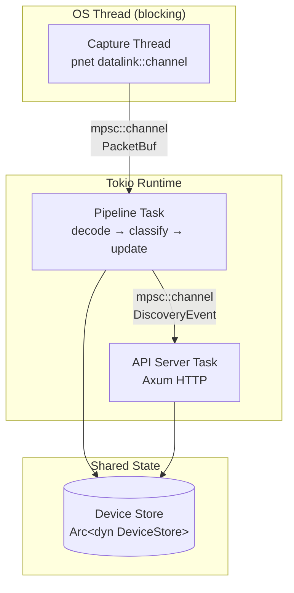
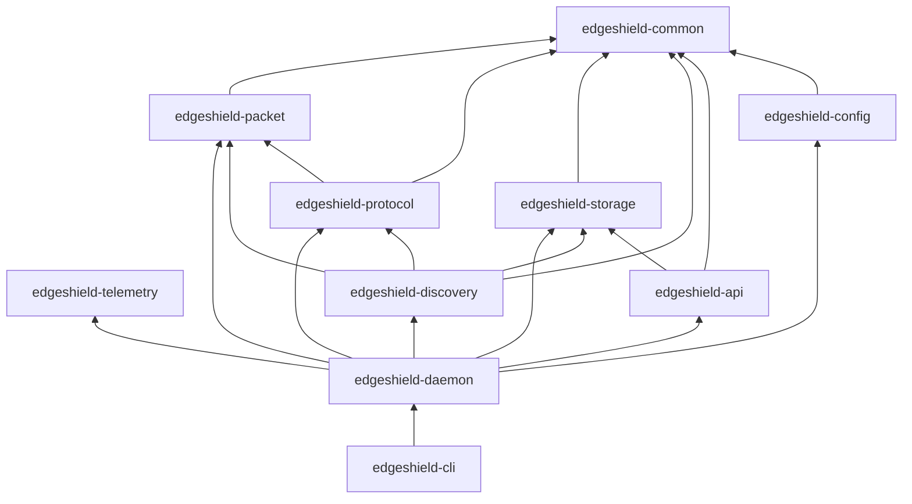
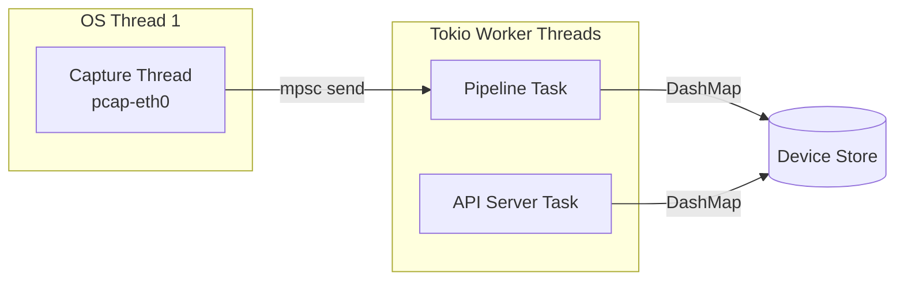

# EdgeShield Architecture

## High-Level Architecture

EdgeShield is a **pipeline-based network monitoring appliance** with three concurrent stages connected by bounded mpsc channels. The architecture prioritizes bounded memory usage, clear ownership boundaries, and minimal shared state.



### Stage 1: Capture Thread

A dedicated OS thread reads raw Ethernet frames from a network interface using `pnet::datalink::channel`. This runs on a blocking OS thread because `pnet`'s datalink API is synchronous and blocking.

- **Buffer model**: Each captured frame is converted from `Vec<u8>` to `bytes::Bytes` (refcounted, `'static` slice) and wrapped in a `PacketBuf` struct.
- **Backpressure**: The mpsc channel between capture and pipeline is bounded. When the channel is full, packets are dropped at the capture level. This is intentional — the system degrades gracefully under load rather than unboundedly growing memory.
- **Thread naming**: The capture thread is named `pcap-{interface}` for observability.

### Stage 2: Pipeline Task

A tokio async task receives `PacketBuf` values from the capture channel and runs them through three sequential stages:

1. **Decode** (`edgeshield-packet`): Parses Ethernet, IPv4, and transport-layer headers. Header fields are copied into owned structs (they are small — MAC addresses are 6 bytes, IP addresses are 4-16 bytes, ports are 2 bytes). The payload is referenced via a borrow into the `PacketBuf`.
2. **Classify** (`edgeshield-protocol`): Pure function that maps decoded headers to a `Protocol` enum variant. No I/O, no state, no allocation.
3. **Update** (`edgeshield-discovery`): Reads or creates `Device` records in the store, updates counters and protocol sets, and emits `DiscoveryEvent` values on the event channel.

### Stage 3: API Server Task

A tokio async task runs an Axum HTTP server. It shares the `DeviceStore` with the pipeline via `Arc<dyn DeviceStore>`. The event channel from the pipeline is available for future WebSocket push.

## Core Subsystems

### `edgeshield-common`

Foundation crate with zero workspace dependencies. Defines:

- `Device` — the central data model (MAC, IPs, hostname, timestamps, counters, protocols)
- `Protocol` — enum of detected protocols (ARP, IPv4, ICMP, TCP, UDP, DNS, Other)
- `Timestamp` — ISO 8601 UTC timestamp newtype
- Error types for every subsystem (`PacketError`, `ConfigError`, `StorageError`, `ApiError`)

### `edgeshield-config`

Reads and validates TOML configuration. Uses `serde` for deserialization with sensible defaults. Validates that the interface name is non-empty at parse time.

### `edgeshield-telemetry`

Initializes the `tracing` subscriber with structured JSON output. Composes layers using `tracing-subscriber`'s `Registry`:

- `EnvFilter` for runtime log level control
- `fmt::layer().json()` for structured JSON output with file, line, span, and target metadata

### `edgeshield-packet`

Owns the packet buffer lifecycle. Two modules:

- `capture`: `CaptureSession` — manages the OS thread, pnet channel, and mpsc bridge. `PacketBuf` — refcounted packet buffer with zero-copy sharing.
- `decode`: `DecodedPacket` — owned header fields with a borrowed payload reference. Parses Ethernet, IPv4, TCP, UDP, ICMP, and ARP.

### `edgeshield-protocol`

Pure protocol classification. The `classify()` function takes a `DecodedPacket` reference and returns a `Protocol` variant. Classification logic:

1. EtherType `0x0806` → ARP
2. EtherType `0x0800` + IP protocol 6 (TCP) → TCP (or DNS if port 53)
3. EtherType `0x0800` + IP protocol 17 (UDP) → UDP (or DNS if port 53)
4. EtherType `0x0800` + IP protocol 1 (ICMP) → ICMP
5. EtherType `0x0800` + no transport → IPv4
6. Anything else → `Other(n)`

### `edgeshield-storage`

Defines the `DeviceStore` trait and provides an in-memory implementation backed by `DashMap`. The trait is the abstraction boundary between discovery and persistence.

```rust
pub trait DeviceStore: Send + Sync {
    fn get(&self, mac: &MacAddress) -> Result<Option<Device>, StorageError>;
    fn upsert(&self, device: Device) -> Result<(), StorageError>;
    fn list(&self) -> Result<Vec<Device>, StorageError>;
    fn count(&self) -> Result<usize, StorageError>;
}
```

### `edgeshield-discovery`

The `DiscoveryEngine` is the stateful core. It holds an `Arc<dyn DeviceStore>` and an event sender. The `process_packet()` method runs the full decode-classify-update pipeline for a single packet.

### `edgeshield-api`

Axum-based REST API with four endpoints. `AppState` holds the shared store and event receiver. Route handlers are standalone functions for testability.

### `edgeshield-daemon`

The orchestrator. Wires together all subsystems in the `run()` function:

1. Initialize telemetry
2. Create `MemoryStore`
3. Create event channel
4. Create `DiscoveryEngine`
5. Start `CaptureSession`
6. Spawn API server task
7. Spawn pipeline task
8. Wait for `SIGINT`/`SIGTERM`
9. Graceful shutdown

### `edgeshield-cli`

Binary entry point with `clap` argument parsing. Two subcommands: `run` and `default-config`.

## Layered Architecture



## Dependency Direction

Dependencies flow **inward** toward `edgeshield-common`. No crate at a lower layer depends on a crate at a higher layer.

| Layer | Crates | Depends On |
|-------|--------|------------|
| 0 (Foundation) | `common` | (none) |
| 1 (Infrastructure) | `config`, `telemetry` | `common` |
| 2 (Data Plane) | `packet`, `protocol`, `storage` | `common`, `packet` → `common` |
| 3 (Logic) | `discovery` | `common`, `packet`, `protocol`, `storage` |
| 4 (Interface) | `api` | `common`, `discovery`, `storage` |
| 5 (Application) | `daemon` | all above |
| 6 (Entry) | `cli` | `daemon`, `config` |

## Data Flow

### Packet lifecycle

```text
Network Interface
    │
    ▼
pnet::datalink::channel (blocking)
    │  raw: Vec<u8>
    ▼
PacketBuf::new(data, 14)
    │  raw: bytes::Bytes (refcounted)
    │  link_header_len: 14
    ▼
mpsc::channel (bounded, async boundary)
    │
    ▼
decode_packet(&buf)
    │  DecodedPacket { ethernet, ipv4, transport, payload }
    ▼
classify(&decoded)
    │  Protocol::Tcp | Udp | Dns | Arp | Icmp | Ipv4 | Other
    ▼
DiscoveryEngine::process_packet(buf)
    │  store.get() / store.upsert()
    │  event_tx.try_send(DiscoveryEvent)
    ▼
Device Store (DashMap)          Event Channel (mpsc)
    │                               │
    ▼                               ▼
API Server                     (future WebSocket push)
```

### Event flow

```text
DiscoveryEngine
    │  event_tx.try_send(DiscoveryEvent::DeviceDiscovered | DeviceUpdated)
    ▼
mpsc::channel (bounded, 1024 capacity)
    │
    ▼
AppState.event_rx (Arc<Mutex<Receiver>>)
    │
    ▼
(future: WebSocket broadcast to connected clients)
```

## Async Model

EdgeShield uses the **tokio** runtime with the `full` features feature set. The async model is deliberately simple:

- **One runtime, multiple tasks**: A single tokio runtime runs the pipeline task and the API server task. The capture thread is an OS thread, not a tokio task.
- **No async in the hot path**: Packet decoding, classification, and store updates are synchronous. Only the channel receive (`recv().await`) is async. This avoids the overhead of async state machines in the per-packet path.
- **Bounded channels everywhere**: All mpsc channels are bounded. There is no unbounded growth path in the system.

```rust
// The pipeline task — the only async in the per-packet path
tokio::spawn(async move {
    while let Some(buf) = pipeline_rx.recv().await {
        pipeline_engine.process_packet(buf).await;
    }
});
```

## Ownership Model

EdgeShield follows Rust's ownership model strictly:

1. **Packet buffers**: `PacketBuf` wraps `bytes::Bytes`, which is a refcounted, `'static` slice. Cloning a `PacketBuf` bumps the reference count — no data copy. The buffer is allocated once by pnet and shared through the pipeline.
2. **Decoded headers**: Header fields are copied into owned structs. This is the right tradeoff because header fields are small (MAC: 6 bytes, IP: 4-16 bytes, ports: 2 bytes) and owned structs are `Send + Sync` without lifetime complexity.
3. **Device records**: `Device` is `Clone`. The store returns cloned records to avoid holding locks across await points. Updates are read-modify-write under a single shard lock (DashMap).
4. **Store sharing**: `Arc<dyn DeviceStore>` is the sharing primitive. The pipeline and API server each hold an `Arc` to the same `MemoryStore`.

## Threading Model



| Thread/Task | Count | Purpose |
|-------------|-------|---------|
| Capture thread | 1 per interface | Blocking packet capture via pnet |
| Pipeline task | 1 | Decode → classify → update |
| API server task | 1 | Axum HTTP server |
| Tokio worker threads | N (default: CPU count) | Async task scheduling |

The capture thread is the only OS thread. Everything else runs on the tokio runtime. The tokio runtime is configured with the default multi-thread scheduler, which uses one worker thread per CPU core.

## Error Handling Philosophy

EdgeShield uses a layered error handling strategy:

1. **Subsystem errors**: Each crate defines its own error enum using `thiserror`. Errors are explicit variants, not stringly-typed.
2. **Boundary conversion**: At subsystem boundaries, errors are converted to the target subsystem's error type or to `anyhow::Error`.
3. **Pipeline errors**: Errors in the packet pipeline are logged and the packet is dropped. The pipeline never returns errors to the caller — it processes packets in a fire-and-forget loop.
4. **API errors**: API handlers return HTTP status codes with descriptive error messages. Internal errors are logged and returned as 500.
5. **Startup errors**: Configuration and capture initialization errors propagate to the CLI and terminate the process with a clear error message.

```rust
// Example: subsystem error with context
#[derive(Error, Debug)]
pub enum PacketError {
    #[error("failed to open capture interface '{interface}': {source}")]
    CaptureOpen {
        interface: String,
        source: Box<dyn std::error::Error + Send + Sync>,
    },
    #[error("packet too short: expected at least {expected} bytes, got {actual}")]
    Truncated { expected: usize, actual: usize },
}
```

## Extension Points

EdgeShield is designed for extensibility from day one:

### `DeviceStore` trait

The storage backend is abstracted behind a trait. The MVP uses `MemoryStore` (DashMap). Future implementations can add SQLite, PostgreSQL, or any other backend without changing the discovery or API layers.

```rust
pub trait DeviceStore: Send + Sync {
    fn get(&self, mac: &MacAddress) -> Result<Option<Device>, StorageError>;
    fn upsert(&self, device: Device) -> Result<(), StorageError>;
    fn list(&self) -> Result<Vec<Device>, StorageError>;
    fn count(&self) -> Result<usize, StorageError>;
}
```

### Protocol classification

Adding a new protocol requires:
1. Add a variant to `edgeshield_common::Protocol`
2. Add a classification function in `edgeshield_protocol::classifier`
3. Call it from the `classify()` function

### Discovery events

The `DiscoveryEvent` channel allows the API layer to react to device changes without polling. Future uses include:
- WebSocket push to connected clients
- Webhook callbacks
- Metrics export

### Configuration

The `Config` struct uses `serde::Deserialize` with `#[serde(default)]` for optional fields. Adding a new configuration option requires only adding a field to the struct.

## Future Plugin System

The architecture supports a future plugin system through several design decisions:

1. **Trait-based abstraction**: `DeviceStore` is already a trait. Future plugin interfaces (detection engines, output sinks, authentication providers) will follow the same pattern.
2. **Event-driven architecture**: The `DiscoveryEvent` channel is a natural extension point for plugins. Plugins can subscribe to events without modifying core code.
3. **Crate isolation**: Each subsystem is a separate crate with a well-defined public API. Plugins can be distributed as separate crates that depend on `edgeshield-common` and implement the relevant traits.
4. **Dynamic loading (future)**: The workspace structure supports eventual dynamic plugin loading via `libloading` or a WASM-based plugin system. The trait-based interfaces are designed to be FFI-safe with minimal changes.

The planned plugin categories are:

| Category | Examples | Interface |
|----------|----------|-----------|
| Detection | Anomaly detector, signature matcher | `DetectionEngine` trait |
| Output | WebSocket, Webhook, Syslog, Kafka | `OutputSink` trait |
| Storage | SQLite, PostgreSQL, Elasticsearch | `DeviceStore` trait |
| Protocol | HTTP, DHCP, mDNS, LLMNR | Protocol classification extension |
| Authentication | API key, OAuth2, mTLS | `AuthProvider` trait |
