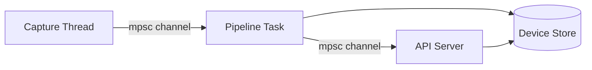

# EdgeShield

**Lightweight, self-hosted network security monitoring for Raspberry Pi and Linux.**

EdgeShield is a passive network monitoring appliance written in Rust. It performs device discovery, protocol analysis, and traffic profiling on your local network — all while maintaining a minimal memory footprint and a privacy-first design. No cloud dependency. No data exfiltration. Everything runs on your hardware.

```text
┌─────────────────────────────────────────────────────┐
│                    EdgeShield                       │
│  ┌──────────┐  ┌──────────┐  ┌──────────────────┐  │
│  │  Packet   │→│ Protocol │→│  Device Discovery │  │
│  │  Capture  │  │  Classify│  │  & Tracking      │  │
│  └──────────┘  └──────────┘  └────────┬─────────┘  │
│                                       │            │
│  ┌────────────────────────────────────▼──────────┐  │
│  │         REST API + SQLite Persistence          │  │
│  └───────────────────────────────────────────────┘  │
└─────────────────────────────────────────────────────┘
```

## Features

- **Passive network monitoring** — listens only, never transmits. No active probing.
- **Device discovery** — automatically identifies every device on your LAN by MAC address.
- **Protocol classification** — detects ARP, IPv4, ICMP, TCP, UDP, and DNS traffic.
- **Traffic profiling** — per-device packet counts, byte counters, and protocol fingerprints.
- **Persistent storage** — SQLite backend so devices survive daemon restarts.
- **REST API** — query device inventory, metrics, and health from any HTTP client.
- **Structured JSON logging** — production-ready observability via `tracing`.
- **Low memory footprint** — designed for Raspberry Pi Zero 2 W and similar constrained hardware.
- **Privacy-first** — no telemetry, no external calls, no cloud dependency.
- **Self-contained binary** — single static binary with no runtime dependencies.

## Goals

- Provide a free, open-source network monitoring tool for homelab users and small businesses.
- Maintain a memory footprint under 50 MB RSS during normal operation.
- Process 10,000+ packets per second on a Raspberry Pi 4.
- Expose a clean, versioned REST API for integration with existing dashboards and alerting systems.
- Remain fully offline-capable — no internet connection required at any point.

## Non-Goals

- **Active network scanning** — EdgeShield does not send probes, pings, or ARP requests. It observes only.
- **Intrusion prevention** — EdgeShield is a monitoring tool, not a firewall or IPS. It cannot block traffic.
- **Deep packet inspection** — EdgeShield classifies protocols but does not reassemble streams or inspect payloads beyond header analysis.
- **Full packet capture** — EdgeShield does not store raw packets. It extracts metadata and discards payloads.
- **Real-time alerting** — The MVP focuses on data collection. Alerting is a future milestone.

## Why Rust

EdgeShield is written in Rust for three reasons:

1. **Memory safety without GC** — Packet capture runs at line rate. A garbage collector would introduce unpredictable latency. Rust's ownership model guarantees memory safety at compile time with zero runtime overhead.
2. **Zero-cost abstractions** — Traits, generics, and iterators compile down to the same machine code as hand-written C. No hidden allocations, no vtable dispatch where it isn't needed.
3. **Target audience alignment** — The security community values memory-safe infrastructure. Rust eliminates entire classes of vulnerabilities (buffer overflows, use-after-free, double-free) that have historically plagued network security tools written in C.

## Architecture Overview

EdgeShield uses a pipeline architecture with three concurrent stages:



| Stage | Runtime | Description |
|-------|---------|-------------|
| Capture | OS Thread (blocking) | Reads raw packets via `pcap` with `promisc(false)` — no WiFi disruption. |
| Pipeline | Tokio Task | Decodes packets, classifies protocols, and updates the device store. |
| API | Tokio Task | Serves the REST API via Axum. Shares the device store with the pipeline. |

The device store is either an in-memory `DashMap` or a persistent SQLite database, selected by configuration. Both implement the `DeviceStore` trait and are shared via `Arc<dyn DeviceStore>`.

## Repository Layout

```
edgeshield/
├── Cargo.toml              # Workspace manifest
├── Makefile                # Build, install, test targets
├── dist/
│   ├── edgeshield.service  # systemd unit file
│   └── edgeshield.8        # Man page
├── .gitea/workflows/
│   └── ci.yaml             # CI pipeline
├── crates/
│   ├── common/             # Shared types, errors, timestamps
│   ├── config/             # TOML configuration parsing
│   ├── telemetry/          # Structured JSON logging (tracing)
│   ├── packet/             # Packet capture (pcap) and header decoding
│   ├── protocol/           # Protocol classification
│   ├── storage/            # Device store trait + MemoryStore + SqliteStore
│   ├── discovery/          # Device discovery engine
│   ├── api/                # REST API (Axum)
│   ├── daemon/             # Application orchestrator
│   └── cli/                # CLI binary entry point
├── docs/
│   ├── architecture/       # System architecture documentation
│   ├── development/        # Developer onboarding and standards
│   ├── api/                # REST API reference
│   ├── security/           # Threat model and cryptography
│   └── adr/                # Architecture Decision Records
├── README.md
├── ROADMAP.md
├── ARCHITECTURE.md
├── CHANGELOG.md
├── SECURITY.md
├── CONTRIBUTING.md
└── SUPPORT.md
```

## Installation

### Building from Source

**Prerequisites:**

- Rust toolchain (stable)
- `libpcap` runtime library (`libpcap.so.1` on Linux)

```bash
git clone https://github.com/edgeshield/edgeshield.git
cd edgeshield
cargo build --release
```

The binary is at `target/release/edgeshield`.

### systemd (Linux)

```bash
sudo make install
sudo systemctl enable edgeshield
sudo systemctl start edgeshield
```

## Running Locally

### 1. Create a configuration file

```toml
# /etc/edgeshield/config.toml
interface = "eth0"
api_port = 8080
log_level = "info"
capture_buffer = 4096
database_path = "/var/lib/edgeshield/devices.db"
```

### 2. Grant capture capabilities (no root required)

```bash
sudo setcap cap_net_raw,cap_net_admin+ep /usr/bin/edgeshield
```

### 3. Run the daemon

```bash
edgeshield run --config /etc/edgeshield/config.toml
```

### 4. Query the API

```bash
# Health check
curl http://localhost:8080/health

# List discovered devices
curl http://localhost:8080/devices

# Get a specific device
curl http://localhost:8080/devices/00:11:22:33:44:55

# Aggregate metrics
curl http://localhost:8080/metrics
```

## Configuration

EdgeShield uses a single TOML configuration file. See [docs/configuration.md](docs/configuration.md) for the full reference.

```toml
# Minimal configuration
interface = "eth0"

# Full configuration with all options
interface       = "eth0"
api_port        = 8080
log_level       = "info"
capture_buffer  = 4096
database_path   = "/var/lib/edgeshield/devices.db"
```

## Logging

EdgeShield uses structured JSON logging via the `tracing` framework. All log output goes to stderr.

```json
{"timestamp":"2026-07-18T12:00:00.000Z","level":"INFO","fields":{"message":"EdgeShield starting"},"target":"edgeshield_daemon::daemon","span":{"name":"daemon","interface":"eth0"}}
```

## API Overview

| Method | Path | Description |
|--------|------|-------------|
| GET | `/health` | Health check (status + version) |
| GET | `/devices` | List all discovered devices |
| GET | `/devices/{mac}` | Get a single device by MAC address |
| GET | `/metrics` | Aggregate network metrics |

See [docs/api/rest.md](docs/api/rest.md) for the complete API reference.

## Security Philosophy

EdgeShield is designed to be secure by default:

- **No network egress** — EdgeShield never initiates outbound connections. It listens on a local port and captures packets from a local interface.
- **No telemetry** — Zero data leaves the device unless explicitly queried via the API.
- **Minimal attack surface** — The REST API exposes only read-only endpoints.
- **Memory safety** — Written in Rust. No buffer overflows, use-after-free, or double-free vulnerabilities.

## Performance Goals

| Metric | Target | Hardware |
|--------|--------|----------|
| Memory (idle) | < 10 MB RSS | Raspberry Pi 4 |
| Memory (1000 devices) | < 50 MB RSS | Raspberry Pi 4 |
| Packet throughput | 10,000+ pps | Raspberry Pi 4 |
| API response time | < 10 ms p99 | Any |
| Startup time | < 1 second | Raspberry Pi 4 |

## Contributing

EdgeShield welcomes contributions. Please see [CONTRIBUTING.md](CONTRIBUTING.md) for detailed guidelines.

Quick start:

```bash
git clone https://github.com/edgeshield/edgeshield.git
cd edgeshield
cargo test
cargo clippy
cargo fmt --check
```

## Roadmap

| Phase | Focus | Status |
|-------|-------|--------|
| 1 | MVP — Device Discovery & Monitoring | ✅ Complete |
| 2 | Production Hardening | ✅ Complete |
| 3 | Persistent Storage (SQLite) | ✅ Complete |
| 4 | Protocol Depth (DHCP, HTTP, mDNS) | 🔄 Next |
| 5 | Alerting & Rules | 📅 Planned |
| 6 | Security & Access Control | 📅 Planned |
| 7 | Packaging & Distribution | 📅 Planned |
| 8 | Web Dashboard | 📅 Planned |

See [ROADMAP.md](ROADMAP.md) for the full development roadmap.

## FAQ

**Q: Does EdgeShield require an internet connection?**

No. EdgeShield is fully offline-capable. It never makes outbound connections.

**Q: Does EdgeShield store packet payloads?**

No. EdgeShield extracts header metadata (MAC addresses, IP addresses, ports, protocol types) and discards the payload. No raw packets are stored.

**Q: Can EdgeShield detect intruders?**

The MVP focuses on device discovery and traffic profiling. Anomaly detection and signature-based intrusion detection are planned for Phase 5.

**Q: What hardware do I need?**

EdgeShield runs on any Linux system with a network interface. A Raspberry Pi 3 or 4 is sufficient for home networks. Raspberry Pi Zero 2 W works for smaller networks (< 20 devices).

**Q: Does EdgeShield support Wi-Fi interfaces?**

Yes. EdgeShield uses read-only capture mode (`promisc(false)`) that does not disrupt normal WiFi connectivity. No monitor mode or special drivers required.

**Q: How is EdgeShield different from Wireshark, Suricata, or Zeek?**

Wireshark is an interactive packet analyzer. Suricata and Zeek are full-featured IDS/IPS systems. EdgeShield is a lightweight, purpose-built device discovery and traffic profiling tool. It does not do deep packet inspection, stream reassembly, or signature matching. It is designed for continuous passive monitoring on resource-constrained hardware.

## License

EdgeShield is dual-licensed:

- **Community Edition**: [MIT](LICENSE-MIT) or [Apache 2.0](LICENSE-APACHE)
- **Commercial Edition**: Proprietary (see [LICENSES.md](LICENSES.md))

The Community Edition is free for all use — personal, educational, and commercial.
