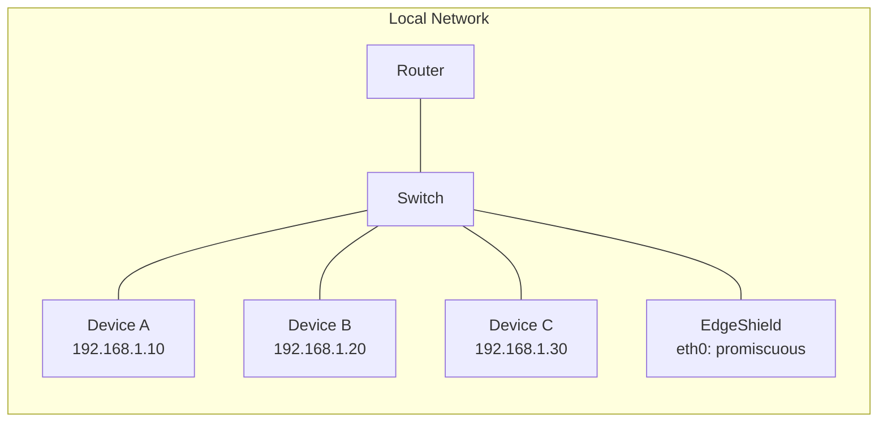
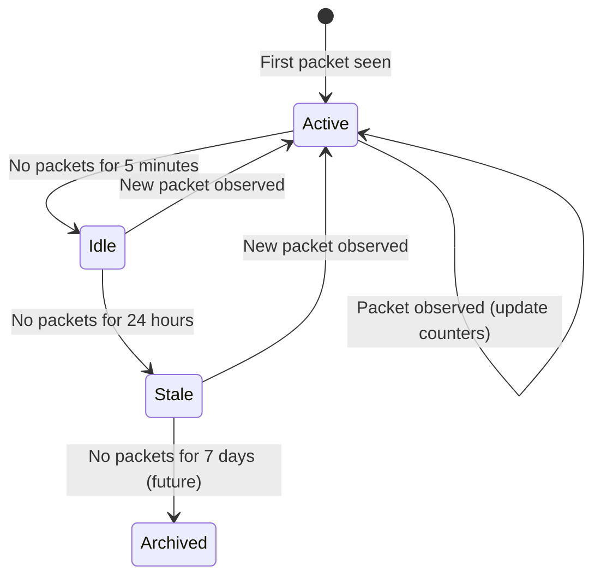

# Network Architecture

## Overview

EdgeShield operates as a passive observer on a local network segment. It captures raw Ethernet frames from a network interface in promiscuous mode, decodes protocol headers, and tracks device activity — all without transmitting a single packet.



## Packet Flow

### Capture path

```text
Network Interface (promiscuous mode)
    │
    ▼
Kernel: raw socket (AF_PACKET, SOCK_RAW)
    │  pnet opens a datalink channel
    ▼
pnet::datalink::channel
    │  Channel::Ethernet(_, rx)
    ▼
Capture Thread (blocking loop)
    │  rx.next() → Vec<u8>
    ▼
PacketBuf::new(data, 14)
    │  Vec<u8> → bytes::Bytes (refcounted)
    ▼
mpsc::channel::try_send(PacketBuf)
    │  bounded channel, drops on overflow
    ▼
Pipeline Task (async)
    │  decode_packet() → classify() → update_devices()
    ▼
Device Store (DashMap)
```

### Promiscuous mode

EdgeShield places the capture interface into promiscuous mode. This causes the kernel to forward all frames received by the network interface to the application, not just frames addressed to the interface's MAC address.

On a switched network, the switch only forwards frames to the port where EdgeShield is connected. To see traffic between other devices, the switch port must be configured for:

- **Port mirroring (SPAN)**: The switch copies traffic from other ports to the EdgeShield port
- **Network tap**: A physical device that copies all traffic to the EdgeShield port
- **Hub**: An old-fashioned hub repeats all traffic to all ports (rare in modern networks)

On a Wi-Fi interface, the interface must support **monitor mode** (also called RFMON). Monitor mode allows the interface to capture all 802.11 frames on a channel without associating with an access point.

### Frame reception

The kernel delivers raw Ethernet frames to EdgeShield via `AF_PACKET` sockets. `pnet` abstracts this into a `DataLinkReceiver` that returns `Vec<u8>` buffers.

Each frame includes:

| Offset | Length | Field |
|--------|--------|-------|
| 0 | 6 | Destination MAC |
| 6 | 6 | Source MAC |
| 12 | 2 | EtherType |
| 14 | N | Payload (EtherType-dependent) |

EdgeShield assumes a 14-byte Ethernet header (no 802.1Q VLAN tag). VLAN-tagged frames (EtherType 0x8100) are not yet supported.

## Protocol Parsing

### Ethernet layer

The Ethernet header is always parsed. It provides:

- **Source MAC**: Identifies the sending device
- **Destination MAC**: Identifies the intended recipient
- **EtherType**: Identifies the network-layer protocol

```text
 0                   1                   2                   3
 0 1 2 3 4 5 6 7 8 9 0 1 2 3 4 5 6 7 8 9 0 1 2 3 4 5 6 7 8 9 0 1
├───────┬───────┬───────┬───────┬───────┬───────┬───────┬───────┤
│                    Destination MAC (6)                          │
├───────┬───────┬───────┬───────┬───────┬───────┬───────┬───────┤
│                      Source MAC (6)                             │
├───────┬───────┬───────┬───────┬───────┬───────┬───────┬───────┤
│      EtherType (2)              │                              │
├───────┬───────┬───────┬───────┤                              │
│                              Payload                           │
│                                                               │
```

### IPv4 layer

If the EtherType is 0x0800 (IPv4), the IPv4 header is parsed. It provides:

- **Source IP**: Identifies the sending device on the network layer
- **Destination IP**: Identifies the intended recipient on the network layer
- **Protocol**: Identifies the transport-layer protocol (TCP=6, UDP=17, ICMP=1)
- **Total length**: Total IP packet length (header + payload)
- **Header length**: IP header length in bytes (used to find transport header offset)

```text
 0                   1                   2                   3
 0 1 2 3 4 5 6 7 8 9 0 1 2 3 4 5 6 7 8 9 0 1 2 3 4 5 6 7 8 9 0 1
├───────┬───────┬───────┬───────┬───────┬───────┬───────┬───────┤
│Vers│ IHL │  DSCP   │ECN│         Total Length                │
├───────┬───────┬───────┬───────┬───────┬───────┬───────┬───────┤
│          ID               │Flags│    Fragment Offset          │
├───────┬───────┬───────┬───────┬───────┬───────┬───────┬───────┤
│   TTL    │  Protocol   │          Header Checksum             │
├───────┬───────┬───────┬───────┬───────┬───────┬───────┬───────┤
│                       Source IP                               │
├───────┬───────┬───────┬───────┬───────┬───────┬───────┬───────┤
│                     Destination IP                            │
├───────┬───────┬───────┬───────┬───────┬───────┬───────┬───────┤
│                    Options (if IHL > 5)                        │
├───────┬───────┬───────┬───────┬───────┬───────┬───────┬───────┤
│                        Payload                                │
```

IPv6 is not yet supported. Frames with EtherType 0x86DD (IPv6) are classified as `Other(0)`.

### Transport layer

If the IPv4 protocol field indicates TCP (6), UDP (17), or ICMP (1), the transport header is parsed.

**TCP header**:

| Field | Size | Description |
|-------|------|-------------|
| Source port | 2 bytes | Sending application port |
| Destination port | 2 bytes | Receiving application port |
| Data offset | 4 bits | TCP header length in 32-bit words |

**UDP header**:

| Field | Size | Description |
|-------|------|-------------|
| Source port | 2 bytes | Sending application port |
| Destination port | 2 bytes | Receiving application port |
| Length | 2 bytes | UDP datagram length |

**ICMP header**:

| Field | Size | Description |
|-------|------|-------------|
| Type | 1 byte | ICMP message type (8=Echo, 0=Echo Reply) |
| Code | 1 byte | ICMP message subtype |

### ARP

If the EtherType is 0x0806 (ARP), the packet is classified as ARP. Full ARP header parsing (hardware type, protocol type, operation, sender/target MAC/IP) is planned for a future release.

### DNS detection

DNS is detected by examining the transport-layer port number:

- TCP or UDP with source or destination port 53 → DNS

This is a heuristic. It does not parse the DNS message format. False positives are possible if a non-DNS application uses port 53.

## Device Tracking

### Device identity

The primary device identifier is the **MAC address**. MAC addresses are globally unique (in principle) and are present in every Ethernet frame. This makes them the ideal key for device tracking.

IP addresses are secondary identifiers. A device may have multiple IP addresses (e.g., IPv4 and IPv6, or multiple VLANs). IP addresses can change (DHCP lease renewal). MAC addresses are stable for the lifetime of the network interface.

### Device record

Each device is represented by a `Device` struct:

```rust
pub struct Device {
    pub mac: MacAddress,           // Primary key
    pub ips: BTreeSet<IpAddr>,     // Observed IP addresses
    pub hostname: Option<String>,  // Future: DHCP hostname
    pub first_seen: Timestamp,     // First packet observed
    pub last_seen: Timestamp,      // Most recent packet
    pub packet_count: u64,         // Total packets
    pub bytes_sent: u64,           // Total bytes transmitted
    pub bytes_received: u64,       // Total bytes received
    pub protocols: BTreeSet<Protocol>, // Detected protocols
    pub vendor: Option<String>,    // Future: OUI vendor
}
```

### Update logic

For each captured packet, EdgeShield updates two device records:

1. **Source device** (from Ethernet source MAC):
   - `packet_count += 1`
   - `bytes_sent += packet_length`
   - `protocols.insert(classified_protocol)`
   - `ips.insert(source_ip)` (if IPv4)
   - `ips.insert(destination_ip)` (if IPv4)
   - `last_seen = now`

2. **Destination device** (from Ethernet destination MAC, if different from source):
   - `packet_count += 1`
   - `bytes_received += packet_length`
   - `protocols.insert(classified_protocol)`
   - `ips.insert(destination_ip)` (if IPv4)
   - `ips.insert(source_ip)` (if IPv4)
   - `last_seen = now`

### Broadcast and multicast

- **Broadcast MAC** (`FF:FF:FF:FF:FF:FF`): Treated as a destination device. All devices on the LAN receive broadcast frames.
- **Multicast MAC** (`01:00:5E:*` for IPv4, `33:33:*` for IPv6): Treated as a destination device. Only devices subscribed to the multicast group receive these frames.
- EdgeShield tracks broadcast/multicast destinations as a single device record per unique MAC.

### Device lifecycle



The MVP does not implement device lifecycle state transitions. All devices remain in the store until the application is restarted. Future versions will add:

- **Idle detection**: Devices not seen for N minutes are flagged as idle
- **Stale cleanup**: Devices not seen for N days are removed from the active store
- **History preservation**: Archived devices are moved to persistent storage

## Future Rule Engine

The rule engine (planned for Phase 7) will evaluate network activity against configurable rules and generate alerts.

### Rule types

| Rule Type | Description | Example |
|-----------|-------------|---------|
| New device | Alert when an unknown MAC appears | `00:11:22:33:44:55 first seen` |
| New IP | Alert when a device uses a new IP | `Device A (known at 192.168.1.10) now at 10.0.0.5` |
| Protocol change | Alert when a device uses a new protocol | `Device A (TCP only) now using ICMP` |
| Volume spike | Alert when traffic exceeds threshold | `Device A sent 10x normal traffic in 5 minutes` |
| ARP spoof | Alert on duplicate MAC/IP bindings | `IP 192.168.1.1 claimed by MAC A and MAC B` |
| Port scan | Alert on connection attempts to many ports | `Device A connected to 50 different ports on Device B` |

### Rule evaluation

Rules are evaluated periodically (not per-packet) to avoid impacting capture throughput. The evaluation interval is configurable (default: 60 seconds).

### Alert format

```json
{
  "id": "alert-20260718-001",
  "timestamp": "2026-07-18T12:00:00.000Z",
  "severity": "medium",
  "rule": "new-device",
  "device": {
    "mac": "00:11:22:33:44:55",
    "ip": "192.168.1.100"
  },
  "message": "New device discovered: 00:11:22:33:44:55 (192.168.1.100)",
  "details": {
    "first_seen": "2026-07-18T12:00:00.000Z",
    "vendor": "Raspberry Pi Trading"
  }
}
```

### Rule configuration

Rules are configured in the TOML configuration file:

```toml
[rules]
enabled = ["new-device", "protocol-change", "volume-spike"]

[rules.volume-spike]
threshold_multiplier = 10
window_minutes = 5
cooldown_minutes = 30
```
