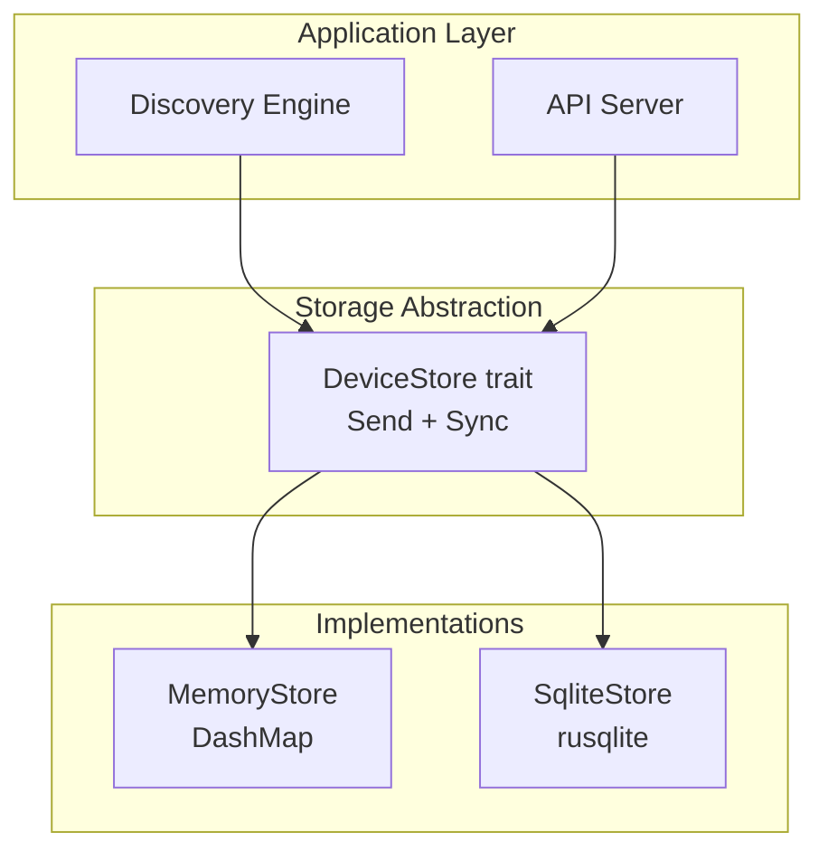
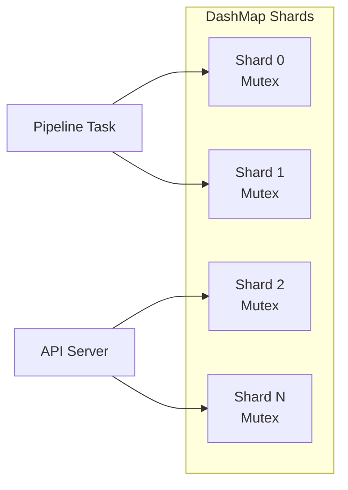

# Storage Architecture

## Overview

EdgeShield uses a trait-based storage abstraction that decouples the discovery and API layers from the persistence implementation. The MVP ships with an in-memory store, with SQLite planned for Phase 6.



## Storage Trait

The `DeviceStore` trait is the core abstraction. It defines four operations:

```rust
pub trait DeviceStore: Send + Sync {
    fn get(&self, mac: &MacAddress) -> Result<Option<Device>, StorageError>;
    fn upsert(&self, device: Device) -> Result<(), StorageError>;
    fn list(&self) -> Result<Vec<Device>, StorageError>;
    fn count(&self) -> Result<usize, StorageError>;
}
```

### Design decisions

- **`Send + Sync`**: The trait must be safe to share across threads. The store is accessed concurrently from the pipeline task and the API server task.
- **`&self` not `&mut self`**: All methods take an immutable reference. Interior mutability (DashMap shard locks, SQLite connection mutex) is handled by the implementation.
- **`Result` return**: All operations can fail. The error type is `StorageError`, which is defined in `edgeshield-common`.
- **Owned types**: `Device` is returned by value (cloned). This avoids lifetime complexity and ensures the caller has an independent copy.

## In-Memory Store (MVP)

### Implementation

`MemoryStore` wraps `DashMap<MacAddress, Device>`. `DashMap` is a concurrent hash map that uses sharded internal locks for lock-free reads and fine-grained write locking.

```rust
pub struct MemoryStore {
    devices: Arc<DashMap<MacAddress, Device>>,
}
```

### Concurrency model



- Reads to different MAC addresses proceed in parallel (different shards)
- Writes to different MAC addresses proceed in parallel
- A read and write to the same MAC address are serialized by the shard lock
- The `Arc` allows the store to be shared between the pipeline and API server

### Performance characteristics

| Operation | Complexity | Notes |
|-----------|------------|-------|
| `get` | O(1) average | Hash lookup, clone device |
| `upsert` | O(1) average | Hash lookup, insert device |
| `list` | O(N) | Iterate all shards, collect, sort |
| `count` | O(1) | DashMap tracks length internally |

### Limitations

- **No persistence**: All data is lost on restart
- **Memory bound**: All devices are kept in memory indefinitely
- **No history**: Only the current state is stored. Historical data is not available
- **No querying**: Only primary-key lookups and full scans are supported

## SQLite Store (Implemented)

### Implementation

`SqliteStore` wraps a `rusqlite::Connection` in a `Mutex` for `Sync` safety. The database is opened with WAL mode for concurrent read performance during writes.

```rust
pub struct SqliteStore {
    conn: Mutex<Connection>,
}
```

### Schema

```sql
-- Device table
CREATE TABLE devices (
    mac BLOB PRIMARY KEY,           -- 6-byte MAC address
    ips TEXT NOT NULL DEFAULT '[]',  -- JSON array of IP addresses
    hostname TEXT,                   -- Optional hostname
    first_seen TEXT NOT NULL,        -- ISO 8601 timestamp
    last_seen TEXT NOT NULL,         -- ISO 8601 timestamp
    packet_count INTEGER NOT NULL DEFAULT 0,
    bytes_sent INTEGER NOT NULL DEFAULT 0,
    bytes_received INTEGER NOT NULL DEFAULT 0,
    protocols TEXT NOT NULL DEFAULT '[]',  -- JSON array of protocol names
    vendor TEXT,                     -- Optional OUI vendor
    updated_at TEXT NOT NULL         -- ISO 8601 timestamp
);

-- Index for listing by last_seen
CREATE INDEX idx_devices_last_seen ON devices(last_seen);

-- Index for listing by first_seen
CREATE INDEX idx_devices_first_seen ON devices(first_seen);

-- Events table (for future use)
CREATE TABLE events (
    id INTEGER PRIMARY KEY AUTOINCREMENT,
    event_type TEXT NOT NULL,        -- 'device_discovered', 'device_updated', 'alert'
    mac BLOB NOT NULL,              -- Related device MAC
    data TEXT NOT NULL,              -- JSON event payload
    created_at TEXT NOT NULL         -- ISO 8601 timestamp
);

CREATE INDEX idx_events_created_at ON events(created_at);
CREATE INDEX idx_events_mac ON events(mac);

-- Metrics snapshots (for future use)
CREATE TABLE metrics_snapshots (
    id INTEGER PRIMARY KEY AUTOINCREMENT,
    total_devices INTEGER NOT NULL,
    total_packets INTEGER NOT NULL,
    total_bytes INTEGER NOT NULL,
    captured_at TEXT NOT NULL         -- ISO 8601 timestamp
);

CREATE INDEX idx_metrics_captured_at ON metrics_snapshots(captured_at);
```

### Implementation approach

```rust
pub struct SqliteStore {
    conn: rusqlite::Connection,  // Wrapped in Mutex for Sync
}

impl DeviceStore for SqliteStore {
    fn get(&self, mac: &MacAddress) -> Result<Option<Device>, StorageError> {
        // SELECT * FROM devices WHERE mac = ?
    }

    fn upsert(&self, device: Device) -> Result<(), StorageError> {
        // INSERT INTO devices ... ON CONFLICT(mac) DO UPDATE SET ...
    }

    fn list(&self) -> Result<Vec<Device>, StorageError> {
        // SELECT * FROM devices ORDER BY mac
    }

    fn count(&self) -> Result<usize, StorageError> {
        // SELECT COUNT(*) FROM devices
    }
}
```

### Connection management

- Single SQLite connection (wrapped in `Mutex` for `Sync`)
- WAL mode for concurrent reads during writes
- `PRAGMA journal_mode=WAL`
- `PRAGMA synchronous=NORMAL`
- `PRAGMA busy_timeout=5000`

### Migration strategy

Schema migrations use a version table:

```sql
CREATE TABLE schema_version (
    version INTEGER PRIMARY KEY,
    applied_at TEXT NOT NULL
);
```

Migrations are applied automatically on startup:

1. Check current schema version
2. Apply any unapplied migrations in order
3. Log migration results

## Retention

### Data retention policy

| Data Type | Retention | Configuration |
|-----------|-----------|---------------|
| Active devices | Indefinite | N/A |
| Event history | 7 days (default) | `retention.events_days` |
| Metrics snapshots | 30 days (default) | `retention.metrics_days` |
| Alert history | 90 days (default) | `retention.alerts_days` |

### Pruning

Pruning runs on a configurable interval (default: daily at 03:00). It deletes records older than the retention period.

```sql
-- Prune events
DELETE FROM events WHERE created_at < datetime('now', '-7 days');

-- Prune metrics
DELETE FROM metrics_snapshots WHERE captured_at < datetime('now', '-30 days');
```

### Configuration

```toml
[storage]
backend = "sqlite"
path = "/var/lib/edgeshield/edgeshield.db"

[storage.retention]
events_days = 7
metrics_days = 30
alerts_days = 90

[storage.pruning]
interval_hours = 24
time = "03:00"
```

## Backups

### Backup command

```bash
edgeshield backup --output /backups/edgeshield-2026-07-18.db
```

### Backup strategy

- **Online backup**: SQLite WAL mode allows consistent backups while the daemon is running
- **Atomic snapshot**: `VACUUM INTO '/path/to/backup.db'` creates a consistent snapshot
- **Compression**: Backups are compressed with gzip
- **Integrity check**: `PRAGMA integrity_check` is run on backup creation

### Restore

```bash
edgeshield restore --input /backups/edgeshield-2026-07-18.db
```

Restore stops the daemon, replaces the database file, and restarts.

## Future Pluggable Storage

The `DeviceStore` trait enables future storage backends without changing the application layer.

### Candidate backends

| Backend | Use Case | Tradeoffs |
|---------|----------|-----------|
| SQLite | Single-instance, embedded | No network access, simple deployment |
| PostgreSQL | Multi-instance, centralized | Requires PostgreSQL server, network latency |
| Redis | High-throughput, ephemeral | No persistence by default, in-memory |
| Elasticsearch | Full-text search, analytics | Heavy, requires Java runtime |
| InfluxDB | Time-series metrics | Specialized for metrics, not device state |

### Backend selection

```toml
[storage]
backend = "postgresql"
host = "10.0.0.5"
port = 5432
database = "edgeshield"
username = "edgeshield"
password = "${STORAGE_PASSWORD}"  # Environment variable substitution
```

## Data Integrity

### Consistency guarantees

| Operation | MemoryStore | SQLiteStore |
|-----------|-------------|-------------|
| `get` | Atomic read | Atomic read |
| `upsert` | Atomic insert/replace | Atomic upsert (ON CONFLICT) |
| `list` | Point-in-time snapshot | Point-in-time snapshot |
| `count` | Atomic read | Atomic read |

### Crash safety

- **MemoryStore**: All data is lost on crash. No recovery possible.
- **SQLiteStore**: WAL mode ensures crash recovery. Uncommitted transactions are rolled back on restart. No data loss for committed writes.

### Validation

- MAC addresses are validated at the type level (`mac_address::MacAddress`)
- IP addresses are validated at the type level (`std::net::IpAddr`)
- Timestamps are validated at the type level (`chrono::DateTime<Utc>`)
- Protocol enums are validated by the type system (no invalid variants)
