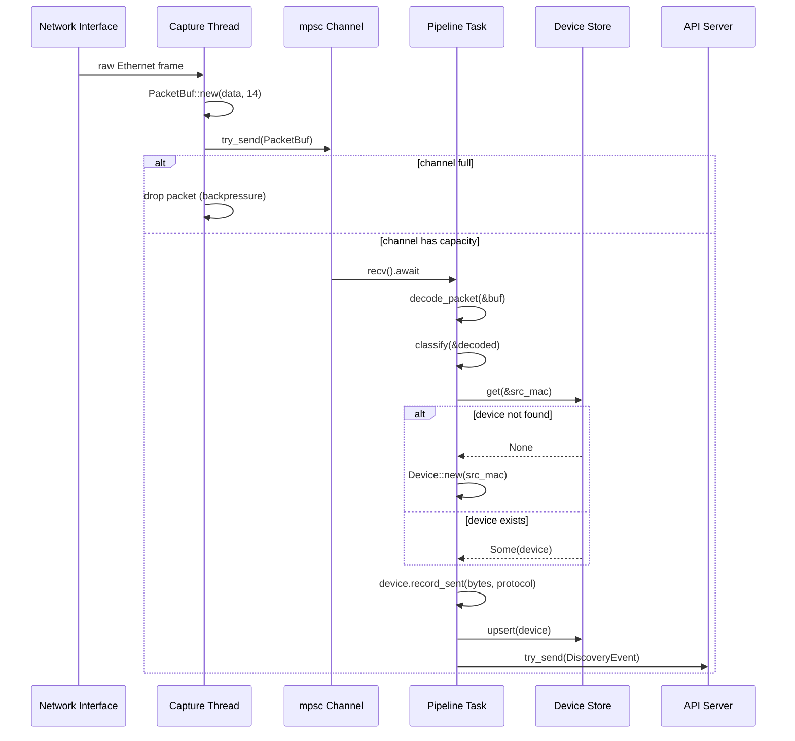
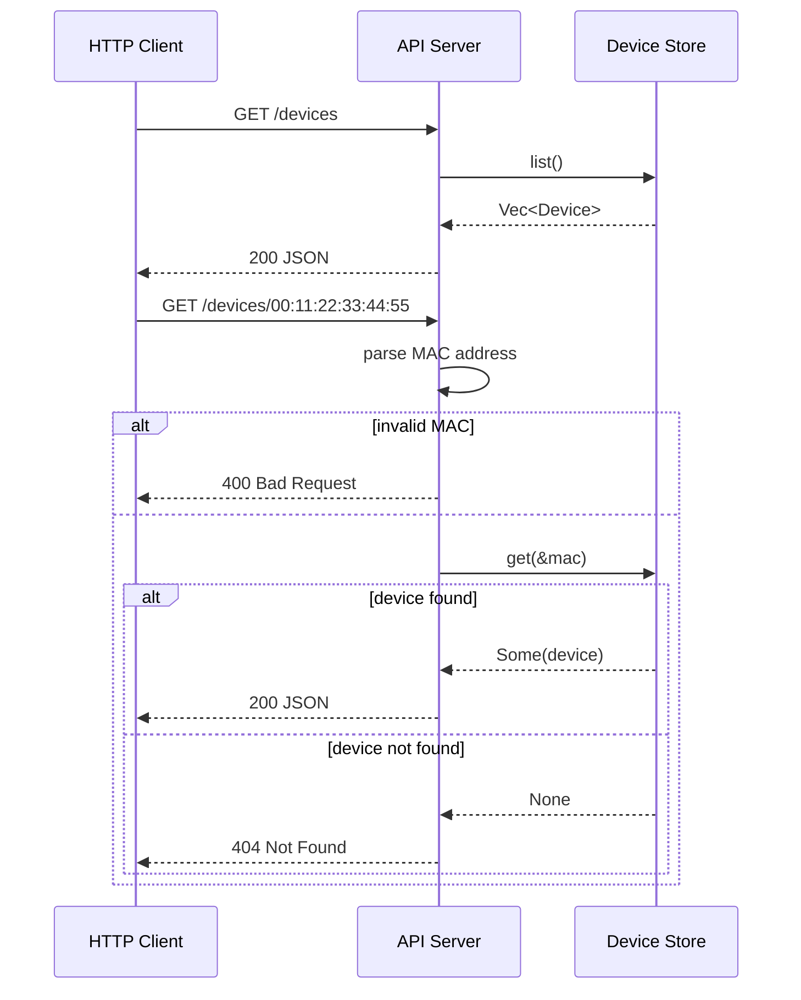
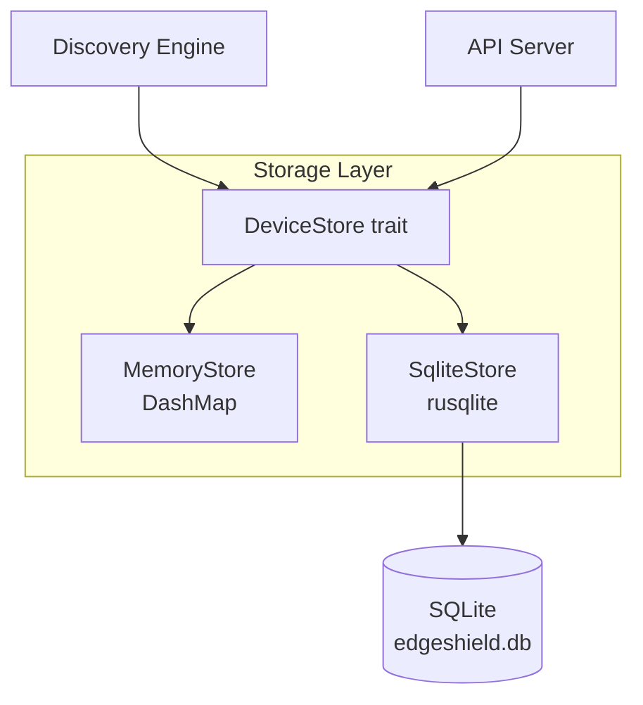
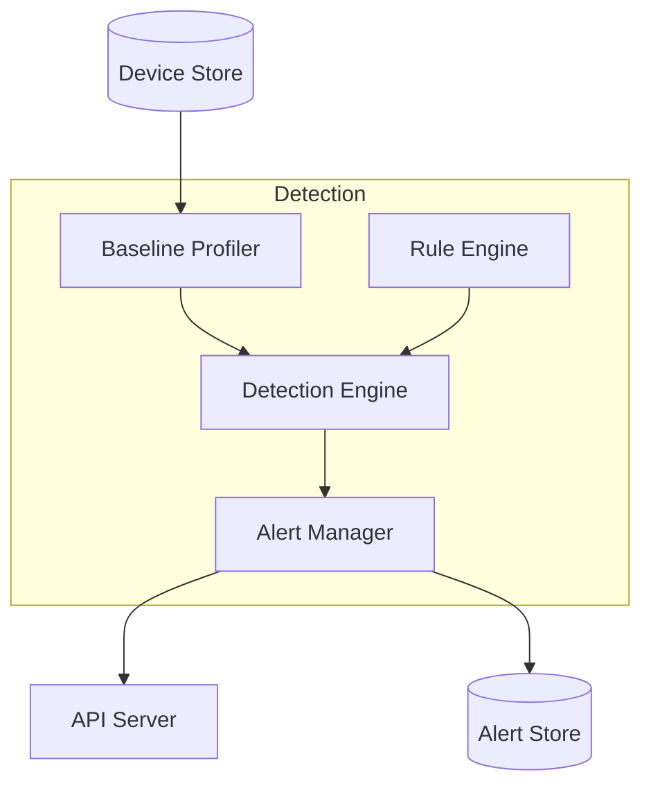
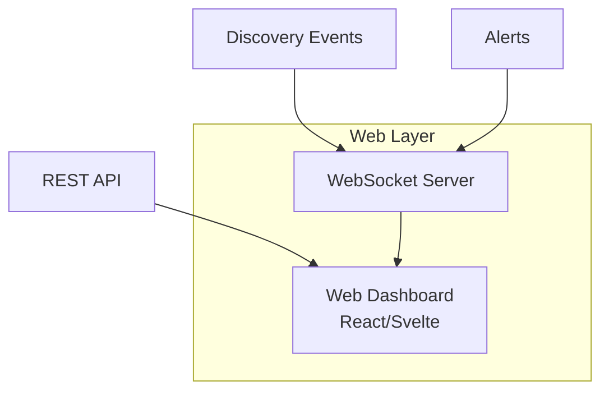

# System Architecture

## Overview

EdgeShield is a passive network security monitoring appliance organized as a pipeline of concurrent stages. The system runs on a single process with one OS thread for packet capture and a tokio async runtime for the pipeline, rule engine, notifiers, and API server.

```mermaid
graph TB
    subgraph "Process Boundary"
        subgraph "OS Thread (blocking)"
            CAP[Capture Thread<br/>pcap]
        end

        subgraph "Tokio Runtime"
            PIP[Pipeline Task<br/>decode + classify + fingerprint]
            RULES[Rule Engine<br/>evaluate rules + emit alerts]
            FANOUT[Notifier Fan-out<br/>ntfy + MQTT + webhook + email]
            SCAN[Offline Scanner<br/>background task]
            HIST[History Snapshot Task<br/>daily snapshots + retention]
            API[API Server<br/>Axum + auth + TLS + audit]
        end

        subgraph "Shared State"
            STORE[(Device Store<br/>DashMap or SQLite)]
            ALERTS[(Alert Store<br/>SQLite or in-memory)]
            HISTORY[(History Store<br/>SQLite)]
        end

        CAP -->|bounded mpsc<br/>PacketBuf| PIP
        PIP -->|bounded mpsc<br/>DiscoveryEvent| RULES
        RULES -->|bounded mpsc<br/>Alert| FANOUT
        PIP -->|read/write| STORE
        RULES -->|write| ALERTS
        SCAN -->|DeviceOffline events| RULES
        HIST -->|read| STORE
        HIST -->|write| HISTORY
        API -->|read| STORE
        API -->|read/write| ALERTS
        API -->|read| HISTORY
    end

    NIC[Network Interface<br/>promisc(false)] -->|raw frames| CAP
    CLIENT[HTTP Client] -->|HTTP/HTTPS| API
    NTFY[ntfy.sh] -.->|POST| FANOUT
    MQTT[MQTT Broker] -.->|publish| FANOUT
    WEBHOOK[Slack/Discord] -.->|POST| FANOUT
    EMAIL[SMTP Server] -.->|email| FANOUT
```

## Design Constraints

### Hardware targets

| Target | CPU | RAM | Storage | Network |
|--------|-----|-----|---------|---------|
| Raspberry Pi Zero 2 W | 4× Cortex-A53 @ 1 GHz | 512 MB | MicroSD | USB Ethernet |
| Raspberry Pi 3 | 4× Cortex-A53 @ 1.2 GHz | 1 GB | MicroSD | Built-in Ethernet |
| Raspberry Pi 4 | 4× Cortex-A72 @ 1.8 GHz | 2-8 GB | MicroSD/USB3 | Gigabit Ethernet |
| Linux x86_64 | Any | 512 MB+ | Any | Any |

### Performance targets

| Metric | Pi Zero 2 W | Pi 3 | Pi 4 |
|--------|-------------|------|------|
| Max throughput | 2,000 pps | 5,000 pps | 10,000+ pps |
| Idle memory | < 5 MB RSS | < 5 MB RSS | < 5 MB RSS |
| Memory (1000 devices) | < 30 MB RSS | < 30 MB RSS | < 30 MB RSS |
| Startup time | < 2 s | < 1 s | < 0.5 s |

## Subsystem Details

### Capture Subsystem

The capture subsystem is the system's entry point. It runs on a dedicated OS thread because `pnet::datalink::channel` uses blocking I/O.

**Thread model**: One OS thread per capture interface. Named `pcap-{interface}` for observability in `top`/`htop`.

**Buffer lifecycle**:
1. `pnet` allocates a `Vec<u8>` for each captured frame
2. The `Vec<u8>` is converted to `bytes::Bytes` (refcounted, `'static`)
3. The `PacketBuf` is sent over a bounded mpsc channel
4. The pipeline receives the `PacketBuf` and decodes headers in-place
5. After decoding, the `PacketBuf` is dropped and the buffer is freed

**Backpressure**: The mpsc channel has a fixed capacity (configurable via `capture_buffer`). When the channel is full, `try_send` fails and the packet is dropped. This is intentional — the system degrades gracefully under load.

**Error handling**: Capture errors (interface not found, permission denied, channel errors) are logged at WARN level. The capture thread continues running. Fatal errors (interface disappears) terminate the thread and the pipeline detects the channel closure.

### Decode Subsystem

The decode subsystem parses raw Ethernet frames into structured headers. It is a pure function with no I/O or side effects.

**Parsing strategy**: We use `pnet::packet` for header parsing. `pnet` provides zero-copy packet views (they borrow from the underlying buffer). We copy header fields into owned structs because:

1. Header fields are small (MAC: 6 bytes, IP: 4-16 bytes, ports: 2 bytes)
2. Owned structs are `Send + Sync` and can cross task boundaries
3. The packet buffer can be dropped immediately after decoding
4. No lifetime complexity in the pipeline

**Supported protocols**:

| Protocol | EtherType | IP Protocol | Parsed Fields |
|----------|-----------|-------------|---------------|
| Ethernet | N/A | N/A | src MAC, dst MAC, EtherType |
| ARP | 0x0806 | N/A | Full ARP packet (future) |
| IPv4 | 0x0800 | N/A | src IP, dst IP, protocol, length |
| TCP | 0x0800 | 6 | src port, dst port |
| UDP | 0x0800 | 17 | src port, dst port |
| ICMP | 0x0800 | 1 | type, code |

**Error handling**: Truncated packets (shorter than the expected header length) return `PacketError::Truncated` with expected and actual sizes. Unknown EtherTypes are not an error — the packet is decoded as Ethernet-only.

### Classify Subsystem

The classify subsystem maps decoded headers to a `Protocol` enum. It is a pure function.

**Classification logic**:

```text
if ethertype == 0x0806 → ARP
if ethertype != 0x0800 → Other(0)
if ip.protocol == 6 (TCP) and (src_port == 53 or dst_port == 53) → DNS
if ip.protocol == 6 (TCP) → TCP
if ip.protocol == 17 (UDP) and (src_port == 53 or dst_port == 53) → DNS
if ip.protocol == 17 (UDP) → UDP
if ip.protocol == 1 (ICMP) → ICMP
if ipv4 present, no transport → IPv4
otherwise → Other(protocol_number)
```

**Extensibility**: Adding a new protocol requires:
1. Add a variant to `Protocol` enum in `edgeshield-common`
2. Add a classification function in `edgeshield-protocol::classifier`
3. Call it from the `classify()` function

### Discovery Subsystem

The discovery subsystem maintains the device inventory. It is the stateful core of the system.

**Device lifecycle**:

1. A packet arrives with source MAC `AA:BB:CC:DD:EE:FF`
2. The store is queried for `AA:BB:CC:DD:EE:FF`
3. If not found, a new `Device` is created with `first_seen = now`
4. The device counters are updated (packet_count, bytes_sent, bytes_received)
5. IP addresses from the packet are added to the device's IP set
6. The protocol is added to the device's protocol set
7. The device is upserted into the store
8. A `DiscoveryEvent` is emitted (DeviceDiscovered or DeviceUpdated)

**Concurrency model**: The discovery engine is called from a single tokio task (the pipeline). It holds no locks across await points. The underlying `DashMap` handles concurrent access from the API server.

**Event channel**: Discovery events are sent over a bounded mpsc channel (capacity: 1024). The API server consumes these events for future WebSocket push. If the channel is full, events are dropped (try_send). This is acceptable because the API server can always query the current state from the store.

### Storage Subsystem

The storage subsystem provides a trait-based abstraction for device persistence.

**Trait**:

```rust
pub trait DeviceStore: Send + Sync {
    fn get(&self, mac: &MacAddress) -> Result<Option<Device>, StorageError>;
    fn upsert(&self, device: Device) -> Result<(), StorageError>;
    fn list(&self) -> Result<Vec<Device>, StorageError>;
    fn count(&self) -> Result<usize, StorageError>;
}
```

**In-memory implementation**: `MemoryStore` wraps `DashMap<MacAddress, Device>`. `DashMap` provides lock-free concurrent access via sharded internal locks. Reads and writes to different MAC addresses proceed in parallel.

**Future SQLite implementation**: The `DeviceStore` trait is designed for a future SQLite backend. The trait methods map directly to SQL operations:

- `get` → `SELECT * FROM devices WHERE mac = ?`
- `upsert` → `INSERT INTO devices ... ON CONFLICT(mac) DO UPDATE ...`
- `list` → `SELECT * FROM devices ORDER BY mac`
- `count` → `SELECT COUNT(*) FROM devices`

### API Subsystem

The API subsystem provides an HTTP interface to the device inventory and system metrics.

**Framework**: Axum 0.7 with Tower middleware.

**State sharing**: `AppState` holds an `Arc<dyn DeviceStore>` and an `Arc<Mutex<mpsc::Receiver<DiscoveryEvent>>>`. The store is shared with the discovery engine. The event receiver is wrapped in a mutex because `mpsc::Receiver` is not `Clone` and not `Sync`.

**Endpoints**:

| Method | Path | Handler | Description |
|--------|------|---------|-------------|
| GET | `/health` | `health()` | Returns status and version |
| GET | `/devices` | `list_devices()` | Returns all devices |
| GET | `/devices/:mac` | `get_device()` | Returns one device |
| GET | `/metrics` | `metrics()` | Returns aggregate metrics |

**Error handling**: Handlers return `Result<Json<T>, (StatusCode, String)>`. Errors are logged at ERROR level with structured fields. The client receives a descriptive error message and appropriate HTTP status code.

### Daemon Subsystem

The daemon is the application orchestrator. It wires together all subsystems and manages the lifecycle.

**Startup sequence**:

1. Initialize telemetry (tracing subscriber)
2. Create the device store (MemoryStore)
3. Create the event channel
4. Create the discovery engine
5. Start packet capture (CaptureSession)
6. Spawn the API server task
7. Spawn the pipeline task
8. Wait for shutdown signal

**Shutdown sequence**:

1. Receive SIGINT/SIGTERM
2. Stop the capture session (signal the thread, join it)
3. The pipeline task finishes when the capture channel closes
4. Abort the API server task
5. Log shutdown complete

**Graceful degradation**: If the API server fails to start, the daemon logs the error and exits. If the capture session fails to start, the daemon logs the error and exits. If the pipeline task panics, the daemon exits (tokio default behavior).

## Data Flow Diagrams

### Packet processing flow



### API request flow



## Resource Management

### Memory

| Component | Allocation | Lifetime |
|-----------|------------|----------|
| PacketBuf | Per-packet | Pipeline processing duration |
| Device record | Per-MAC | Application lifetime |
| DiscoveryEvent | Per-packet (if store updated) | Until consumed by API |
| JSON response | Per-API-request | Request duration |
| Configuration | Once at startup | Application lifetime |

### File descriptors

| Resource | Count | Type |
|----------|-------|------|
| Capture interface | 1 | Raw socket (pnet) |
| API listener | 1 | TCP socket |
| API connections | N | TCP sockets (per client) |
| Configuration file | 1 (briefly) | Regular file |

### Threads

| Thread | Count | Purpose |
|--------|-------|---------|
| Main thread | 1 | CLI parsing, daemon startup |
| Capture thread | 1 per interface | Blocking packet capture |
| Tokio worker threads | N (default: CPU count) | Async task execution |

## Configuration

EdgeShield uses a single TOML configuration file. The configuration is parsed at startup and is immutable thereafter.

```toml
# /etc/edgeshield/config.toml
interface = "eth0"
api_port = 8080
log_level = "info"
capture_buffer = 4096
```

See [docs/configuration.md](../configuration.md) for the full configuration reference.

## Observability

### Logging

All logging uses the `tracing` framework with structured JSON output. Logs go to stderr.

**Log format**:

```json
{
  "timestamp": "2026-07-18T12:00:00.000Z",
  "level": "INFO",
  "fields": {
    "message": "new device discovered",
    "mac": "00:11:22:33:44:55",
    "protocol": "TCP"
  },
  "target": "edgeshield_discovery::discovery",
  "span": {
    "name": "process-packet"
  },
  "file": "crates/discovery/src/discovery.rs",
  "line": 126
}
```

### Metrics

Aggregate metrics are available via the `/metrics` endpoint:

- `total_devices`: Number of unique MAC addresses discovered
- `total_packets`: Sum of all packet counts across all devices
- `total_bytes`: Sum of all bytes sent and received across all devices
- `uptime_seconds`: Seconds since the API server started

## Security Architecture

### Network security

- EdgeShield never initiates outbound connections
- The capture interface is read-only (promiscuous mode, no transmit)
- The API server binds to `0.0.0.0` (future: configurable bind address)
- No authentication in the MVP (future: API keys, mTLS)

### Process security

- Single process, no subprocesses
- No filesystem writes beyond (future) database
- No dynamic code loading
- No `unsafe` code in application logic

### Data security

- No packet payloads are stored
- Device metadata is stored in memory (future: encrypted at rest)
- No telemetry or external data transmission
- All timestamps are UTC (no timezone ambiguity)

## Future Architecture

### Phase 6: Persistent Storage



### Phase 7: Detection Engine



### Phase 8: Dashboard


