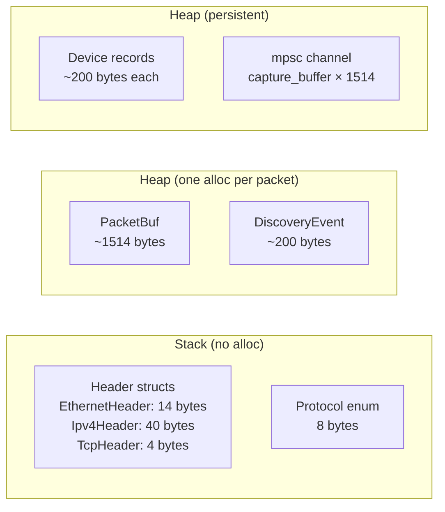

# Performance

## Performance Goals

EdgeShield targets resource-constrained hardware (Raspberry Pi Zero 2 W, Pi 3, Pi 4) while maintaining sufficient throughput for home and small office networks.

### Throughput targets

| Hardware | Target Throughput | Typical Home Network | Headroom |
|----------|------------------|---------------------|----------|
| Pi Zero 2 W | 2,000 pps | 200-500 pps | 4-10× |
| Pi 3 | 5,000 pps | 200-500 pps | 10-25× |
| Pi 4 | 10,000+ pps | 200-500 pps | 20-50× |
| x86_64 Linux | 50,000+ pps | 200-500 pps | 100-250× |

A typical home network with 20-30 devices generates 200-500 packets per second during normal use. Bursts during large file transfers or video streaming can reach 2,000-5,000 pps.

### Memory targets

| Scenario | Target RSS | Notes |
|----------|------------|-------|
| Idle (no devices) | < 5 MB | After startup, before any packets |
| 50 devices | < 10 MB | Typical home network |
| 500 devices | < 30 MB | Large office network |
| 1000 devices | < 50 MB | Maximum supported without persistent storage |

### Latency targets

| Operation | Target | Measurement |
|-----------|--------|-------------|
| Packet decode | < 500 ns | Per-packet, single-threaded |
| Protocol classify | < 100 ns | Per-packet, single-threaded |
| Store upsert | < 1 µs | Per-packet, including DashMap overhead |
| Full pipeline | < 2 µs | Decode + classify + update |
| API response (list) | < 10 ms p99 | 1000 devices |
| API response (get) | < 1 ms p99 | Single device lookup |
| API response (metrics) | < 5 ms p99 | 1000 devices |

## Memory Architecture

### Allocation strategy



### Per-packet allocation budget

| Allocation | Size | Lifetime | Count |
|------------|------|----------|-------|
| `PacketBuf.raw` (Bytes) | ~1514 bytes | Pipeline processing | 1 per packet |
| `DiscoveryEvent` | ~200 bytes | Until consumed by API | 0-2 per packet |
| Header structs | 0 bytes (stack) | Function scope | 0 |
| Protocol enum | 0 bytes (stack) | Function scope | 0 |

### Memory per device

Each `Device` record in the DashMap uses approximately:

| Field | Size | Notes |
|-------|------|-------|
| MAC address | 8 bytes | `MacAddress` (u64 wrapper) |
| IP addresses | ~64 bytes | `BTreeSet<IpAddr>`, average 2-3 IPs |
| Hostname | 0 bytes | `Option<String>`, None until implemented |
| Timestamps | 32 bytes | 2 × `Timestamp` (DateTime<Utc>) |
| Counters | 24 bytes | 3 × u64 |
| Protocols | ~32 bytes | `BTreeSet<Protocol>`, average 3-4 protocols |
| Vendor | 0 bytes | `Option<String>`, None until implemented |
| DashMap overhead | ~64 bytes | Hash table entry, shard lock |
| **Total** | **~224 bytes** | Per device |

For 1000 devices: ~224 KB for device data + DashMap overhead.

### Channel memory

The mpsc channel between capture and pipeline uses:

```
capture_buffer × (PacketBuf size + channel overhead)
4096 × (1514 + 64) ≈ 6.2 MB
```

## CPU Architecture

### Hot path analysis

The per-packet hot path consists of:

1. **Capture thread**: `pnet::datalink::rx.next()` → `PacketBuf::new()` → `tx.try_send()`
   - CPU: Kernel space (socket read) + memcpy (pnet allocates Vec<u8>)
   - Blocking: Yes (pnet is blocking I/O)

2. **Pipeline task**: `rx.recv().await` → `decode_packet()` → `classify()` → `update_devices()`
   - CPU: Header parsing, protocol matching, DashMap operations
   - Blocking: No (all CPU-bound work, no I/O)

3. **API server**: Request handling
   - CPU: JSON serialization, DashMap reads
   - Blocking: No

### Instruction-level optimization

The hot path functions are designed for CPU cache efficiency:

- **Small working set**: Header structs fit in L1 cache (EthernetHeader: 14 bytes, Ipv4Header: 40 bytes)
- **Linear memory access**: Packet buffers are read sequentially
- **No indirect branches**: Protocol classification uses direct matching, not virtual dispatch
- **Predictable branching**: Common protocols (TCP, UDP) are checked first

### CPU cache behavior

```text
L1 Cache (32 KB per core on Pi 4):
  ┌─────────────────────────────────────┐
  │ PacketBuf header (64 bytes)         │  ← Hot
  │ DecodedPacket (128 bytes)           │  ← Hot
  │ Device record (224 bytes)           │  ← Warm
  │ DashMap shard (cache line)          │  ← Warm
  └─────────────────────────────────────┘

L2 Cache (1 MB shared on Pi 4):
  ┌─────────────────────────────────────┐
  │ Packet payload (1514 bytes)         │  ← Cold (read once, discard)
  │ Device store (224 KB for 1000 devs) │  ← Warm
  └─────────────────────────────────────┘
```

## Benchmark Strategy

### Microbenchmarks

Microbenchmarks measure individual operations in isolation. They use Criterion for statistical analysis.

| Benchmark | What it measures | Target |
|-----------|-----------------|--------|
| `decode_ethernet` | Ethernet header parsing | < 100 ns |
| `decode_ipv4` | IPv4 header parsing | < 200 ns |
| `decode_tcp` | TCP header parsing | < 100 ns |
| `classify_tcp` | Protocol classification (TCP) | < 50 ns |
| `classify_dns` | Protocol classification (DNS) | < 50 ns |
| `store_upsert` | DashMap insert | < 500 ns |
| `store_get` | DashMap lookup | < 200 ns |
| `store_list` | DashMap full scan (1000 devices) | < 1 ms |

### Integration benchmarks

Integration benchmarks measure end-to-end throughput:

| Benchmark | What it measures | Target |
|-----------|-----------------|--------|
| `pipeline_throughput` | Packets per second through full pipeline | 10,000+ pps |
| `pipeline_latency_p50` | Median per-packet latency | < 2 µs |
| `pipeline_latency_p99` | P99 per-packet latency | < 10 µs |
| `api_throughput` | API requests per second | 1000+ req/s |
| `memory_steady_state` | RSS after 1 hour at 500 pps | < 30 MB |

### Running benchmarks

```bash
# All benchmarks
cargo bench

# Specific benchmark
cargo bench -- decode_ethernet

# With baseline comparison
cargo bench -- --baseline v0.1.0
```

## Optimization Philosophy

### When to optimize

1. **Measure first**: Never optimize without benchmark data. Use Criterion for microbenchmarks, `perf` for CPU profiling, `valgrind massif` for memory profiling.
2. **Profile the hot path**: The per-packet pipeline is the only hot path. Optimize there first. Everything else is cold path.
3. **Optimize for the common case**: TCP and UDP are the most common protocols. Optimize their classification paths. ARP and ICMP are less common.
4. **Bottleneck-driven**: Find the bottleneck (CPU, memory, channel capacity) and address it. Don't optimize non-bottlenecks.

### What not to optimize

- **Startup time**: Startup happens once. A few hundred milliseconds is acceptable.
- **API response formatting**: JSON serialization is fast enough. Don't hand-roll JSON.
- **Configuration parsing**: Happens once at startup. Not worth optimizing.
- **Error paths**: Errors are rare. Don't optimize error handling at the expense of the happy path.

### Optimization techniques used

| Technique | Where | Impact |
|-----------|-------|--------|
| Zero-copy buffer sharing | PacketBuf (bytes::Bytes) | Eliminates per-packet memcpy |
| Stack allocation | Header structs | Eliminates per-packet heap alloc |
| Lock-free data structures | DashMap | Eliminates mutex contention |
| Bounded channels | mpsc | Bounded memory, predictable backpressure |
| Monomorphized generics | Protocol classification | No vtable dispatch in hot path |
| Branch prediction hints | Protocol matching | Common protocols checked first |

### Optimization techniques avoided

| Technique | Why avoided |
|-----------|-------------|
| `unsafe` code | Safety risk not justified by performance gain |
| Manual SIMD | Not portable across target architectures |
| Custom allocators | Added complexity without measurable benefit |
| Lock-free manual implementation | DashMap provides sufficient performance |
| Assembly optimization | Compiler generates better code than hand-written asm |

## Profiling

### CPU profiling with perf

```bash
# Build with frame pointers
RUSTFLAGS="-C force-frame-pointers=y" cargo build --release

# Profile for 30 seconds
sudo perf record -g -F 99 -- target/release/edgeshield run --config config.toml &
sleep 30
sudo killall edgeshield

# Generate report
sudo perf report
```

### Memory profiling with valgrind

```bash
# Heap profiling
valgrind --tool=massif target/release/edgeshield run --config config.toml

# View results
ms_print massif.out.*
```

### Tracing with tokio-console

```bash
# Build with tokio-console support
RUSTFLAGS="--cfg tokio_unstable" cargo build --release

# Run with console subscriber
tokio-console
```

## Performance Regression Testing

Every pull request that touches the hot path must include benchmark results showing no regression.

### CI benchmark gate

```yaml
# .github/workflows/benchmark.yml
- name: Run benchmarks
  run: cargo bench -- --output-format bencher | tee output.txt

- name: Compare with baseline
  run: |
    # Compare with main branch baseline
    # Fail if any benchmark regresses by more than 5%
```

### Benchmark comparison

```bash
# Run benchmarks and save baseline
cargo bench -- --save-baseline v0.1.0

# Run benchmarks and compare
cargo bench -- --baseline v0.1.0
```

Criterion reports statistically significant changes with confidence intervals. A regression is flagged if the 99% confidence intervals do not overlap.
