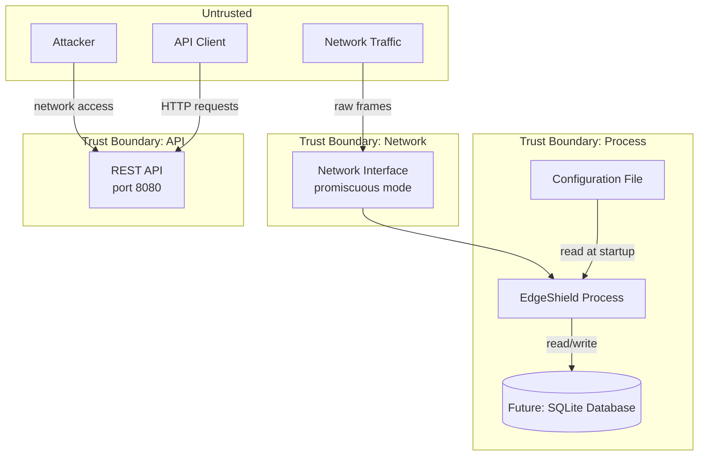

# Threat Model

## Overview

This document describes the threat model for EdgeShield. It identifies assets, trust boundaries, attack surfaces, threat actors, and mitigations. The threat model follows the [STRIDE](https://en.wikipedia.org/wiki/STRIDE_(security)) methodology.

## Assets

| Asset | Description | Sensitivity | Location |
|-------|-------------|-------------|----------|
| Device inventory | MAC addresses, IP addresses, hostnames, traffic patterns | Medium | In-memory store, (future) SQLite database |
| Configuration | Interface selection, API port, log level | Low | Filesystem (`/etc/edgeshield/config.toml`) |
| API access | Read-only access to network metadata | Medium | Network socket (port 8080) |
| Binary integrity | The EdgeShield executable | High | Filesystem (`/usr/local/bin/edgeshield`) |
| System resources | CPU, memory, network bandwidth | Low | Host system |

### Asset criticality

| Asset | Confidentiality | Integrity | Availability |
|-------|----------------|-----------|--------------|
| Device inventory | Medium | Medium | Low |
| Configuration | Low | High | Medium |
| API access | Medium | High | Medium |
| Binary integrity | N/A | High | High |
| System resources | N/A | N/A | Medium |

## Trust Boundaries

### Boundary 1: Network Interface → EdgeShield

The capture interface receives raw Ethernet frames from the local network. Any device on the same LAN segment can send frames to this interface. The interface is in promiscuous mode, so all frames on the network segment are delivered to EdgeShield.

**Trust**: Untrusted. Network traffic can be malicious, malformed, or spoofed.

### Boundary 2: Filesystem → EdgeShield

The configuration file is read at startup. An attacker with filesystem access can modify the configuration.

**Trust**: Partially trusted. The configuration file should be protected by filesystem permissions.

### Boundary 3: API Port → EdgeShield

The REST API is accessible to any client that can reach the configured port. In the MVP, there is no authentication.

**Trust**: Untrusted. API clients can be malicious.

## Attack Surfaces

### 1. Packet Capture

**Attack vector**: Malformed packets designed to exploit parsing vulnerabilities.

**Attack types**:
- **Buffer overflow**: Oversized or undersized packets that trigger out-of-bounds access
- **Protocol confusion**: Packets with misleading EtherType or IP protocol fields
- **Resource exhaustion**: High packet rate causing channel overflow or CPU saturation
- **ARP spoofing**: Malicious ARP packets to poison the device inventory

**Impact**: Denial of service, potential memory corruption (mitigated by Rust's safety guarantees), false device records.

### 2. REST API

**Attack vector**: HTTP requests to the API server.

**Attack types**:
- **Information disclosure**: Querying the device inventory to map the network
- **Denial of service**: High request rate causing resource exhaustion
- **Path traversal**: Malformed MAC address in URL path
- **Reconnaissance**: Probing endpoints to discover API capabilities

**Impact**: Network mapping by attackers, denial of service.

### 3. Configuration File

**Attack vector**: Malicious configuration values.

**Attack types**:
- **Interface redirection**: Pointing capture to a different interface
- **Port hijacking**: Changing the API port to a privileged port
- **Log manipulation**: Disabling logging to hide activity

**Impact**: Reduced visibility, denial of service, potential privilege escalation.

### 4. Dependencies

**Attack vector**: Vulnerabilities in third-party crates.

**Attack types**:
- **Known vulnerability**: Exploitation of a published CVE in a dependency
- **Supply chain attack**: Malicious code in a compromised dependency
- **Transitive vulnerability**: Vulnerability in a dependency of a dependency

**Impact**: Varies by vulnerability. Could include remote code execution, information disclosure, denial of service.

## Threat Actors

### 1. Local Network User

**Profile**: A user on the same LAN as EdgeShield. Could be a guest, employee, or compromised device.

**Capabilities**:
- Send arbitrary packets on the local network
- Observe broadcast and multicast traffic
- ARP spoofing (if not mitigated by the switch)
- Cannot access the EdgeShield host directly (no shell access)

**Motivation**: Curiosity, network mapping, bypassing monitoring.

**Risk**: Low to Medium.

### 2. Remote Attacker

**Profile**: An attacker outside the local network who can reach the API port.

**Capabilities**:
- Send HTTP requests to the API
- Cannot send packets on the local network
- Cannot access the EdgeShield host directly

**Motivation**: Network reconnaissance, denial of service.

**Risk**: Low (API is read-only, no authentication bypass needed).

### 3. Host Malware

**Profile**: Malware running on the EdgeShield host with user-level or root-level access.

**Capabilities**:
- Read the device store (in-memory or on disk)
- Modify the configuration file
- Replace the EdgeShield binary
- Access the API via localhost
- Stop the EdgeShield process

**Motivation**: Covering tracks, network reconnaissance, using EdgeShield as a pivot.

**Risk**: High. If the host is compromised, all assets are at risk.

### 4. Supply Chain Attacker

**Profile**: An attacker who compromises a dependency used by EdgeShield.

**Capabilities**:
- Execute arbitrary code in the EdgeShield process
- Access all in-memory data
- Modify behavior at runtime

**Motivation**: Broad exploitation of all EdgeShield installations.

**Risk**: Medium. Mitigated by dependency auditing and minimal dependency policy.

## Mitigations

### Implemented

| Threat | Mitigation | Mechanism |
|--------|------------|-----------|
| Buffer overflow | Memory-safe language | Rust's type system and ownership model |
| Use-after-free | Memory-safe language | Rust's borrow checker |
| Malformed packets | Defensive parsing | All parsing checks lengths before access |
| Resource exhaustion | Bounded channels | mpsc channels have fixed capacity |
| Information disclosure | Read-only API | No mutation endpoints in MVP |
| Path traversal | Input validation | MAC address format is validated |
| Dependency vulnerabilities | Regular auditing | `cargo audit` in CI |

### Planned

| Threat | Mitigation | Phase |
|--------|------------|-------|
| Unauthenticated API access | API key authentication | Phase 8 |
| Unauthorized API access | Role-based access control | Phase 9 |
| Eavesdropping on API | TLS encryption | Phase 8 |
| Configuration tampering | File integrity monitoring | Phase 7 |
| ARP spoofing | ARP detection rules | Phase 7 |
| Supply chain attack | Dependency pinning + lockfile | Ongoing |

### Accepted Risks

| Risk | Rationale |
|------|-----------|
| No authentication on API | MVP scope. API is read-only. Risk is low. |
| No TLS on API | MVP scope. Should be deployed behind a reverse proxy. |
| No rate limiting | MVP scope. Risk of DoS is low for local deployments. |
| No host intrusion detection | Out of scope. Host security is the operator's responsibility. |
| No encrypted storage | MVP scope. Device data is not highly sensitive. |

## Security Assumptions

EdgeShield makes the following security assumptions:

1. **The host operating system is trusted**. EdgeShield does not protect against a compromised host.
2. **The network interface is dedicated to monitoring**. EdgeShield does not transmit on the capture interface.
3. **The configuration file is protected by filesystem permissions**. EdgeShield does not encrypt the configuration.
4. **The API is deployed on a trusted network**. In production, the API should be behind a firewall or reverse proxy.
5. **Dependencies are audited regularly**. EdgeShield relies on `cargo audit` and community vulnerability reporting.

## Security Testing

### Regular testing

| Test | Frequency | Tool |
|------|-----------|------|
| Dependency audit | Every CI run | `cargo audit` |
| Static analysis | Every CI run | `cargo clippy` |
| Fuzz testing | Weekly | `cargo fuzz` |
| Penetration testing | Per release | External team (commercial edition) |

### Fuzz testing targets

| Target | Description |
|--------|-------------|
| `decode_packet` | Random byte sequences fed to the packet decoder |
| `classify` | Random `DecodedPacket` values fed to the classifier |
| `config_parse` | Random TOML strings fed to the config parser |
| `api_requests` | Random HTTP requests to the API server |

## Incident Response

### If a vulnerability is reported

1. **Triage**: Assess severity and impact within 24 hours
2. **Fix**: Develop and test the fix
3. **Release**: Cut a patch release
4. **Disclosure**: Publish advisory after fix is available

### If a compromise is detected

1. **Isolate**: Disconnect the EdgeShield host from the network
2. **Preserve**: Capture memory and disk for forensic analysis
3. **Analyze**: Determine the attack vector and impact
4. **Remediate**: Apply fixes and restore from backup
5. **Report**: Document the incident and lessons learned

## Future Improvements

| Improvement | Description | Priority |
|-------------|-------------|----------|
| API authentication | API key or mTLS for API access | High |
| TLS encryption | HTTPS for API server | High |
| Rate limiting | Per-IP rate limits for API | Medium |
| Audit logging | Log all API access with client IP | Medium |
| Encrypted storage | Encrypt device data at rest | Low |
| Host integrity | Verify binary and config integrity at startup | Low |
| Network segmentation | Support for multiple capture interfaces | Low |
